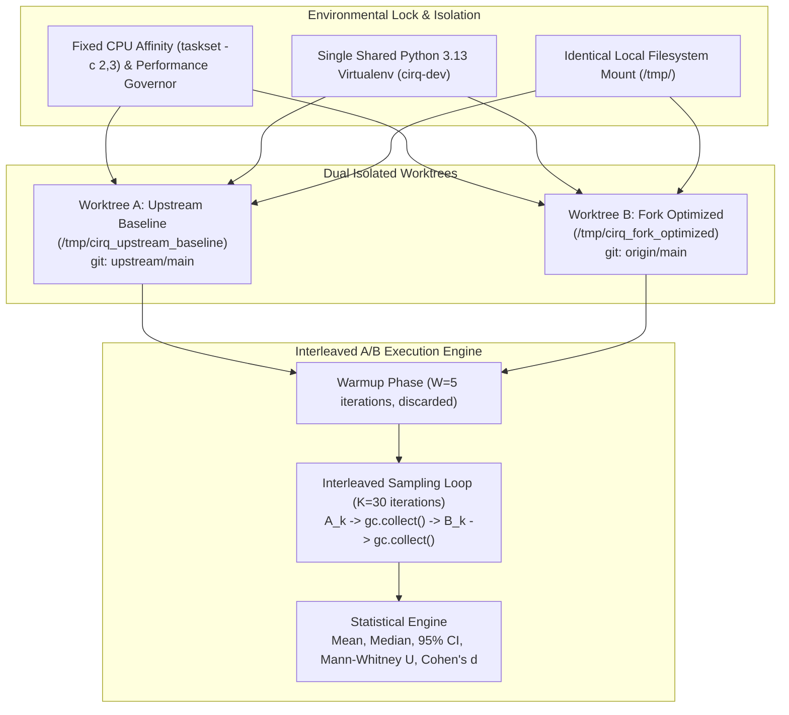
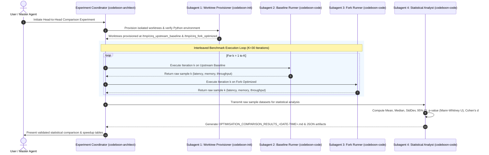

# Cirq Fundamental Operations: Head-to-Head Empirical Benchmark Experiment Specification (OPTIMISATION_COMPARISON_EXPERIMENT.md)

This document specifies the scientific methodology, environmental controls, multi-agent execution architecture, benchmark catalog, and statistical schema for conducting a rigorous **Head-to-Head Empirical Benchmark Experiment** comparing baseline upstream Cirq ([quantumlib/Cirq](https://github.com/quantumlib/Cirq)) against the optimized fork ([akushnarov/Cirq](https://github.com/akushnarov/Cirq)).

---

## 🐙 Git Merge & Target Rules

> [!IMPORTANT]
> **CRITICAL REPOSITORY RULE**: **All experimentation, code modifications, feature branches, and documentation commits MUST ONLY target the Fork (`origin/main` / `git@github.com:akushnarov/Cirq.git`). NEVER merge or push directly to upstream Cirq (`upstream/main` / `quantumlib/Cirq`). Upstream is strictly read-only for baseline fetching and comparison.**

---

## 1. Executive Overview & Experiment Objectives

### 1.1 Core Objective
The objective of this experiment is to provide an indisputable, statistically rigorous empirical comparison between:
1. **Baseline Upstream Cirq (`quantumlib/Cirq` at `upstream/main`)**: The unoptimized reference state prior to Phase 1 enhancements.
2. **Optimized Fork Cirq (`akushnarov/Cirq` at `origin/main`)**: The optimized state incorporating slotted data structures, bitmask moment collisions, $O(1)$ fast-path circuit appending, vectorized surface code generators, compiled SciPy routing paths, linear-time circuit DAGs, and topology-invariant parameter resolution.

### 1.2 Scientific Integrity Principles
To eliminate measurement bias, confounding system noise, and hardware performance drift:
- **Zero Variance Hardware State**: Baseline and Fork runs execute on the exact same physical host machine under locked CPU affinities (`taskset -c`) and fixed CPU governors.
- **Identical Python Runtime & Dependencies**: Both codebases run against the exact same CPython 3.13 virtual environment with identical third-party library versions (`numpy`, `scipy`, `sympy`, `networkx`, `pytest`).
- **Isolated Dual Worktrees**: Baseline and Fork repositories reside in separate, clean directory worktrees (`/tmp/cirq_upstream_baseline` vs `/tmp/cirq_fork_optimized`) on the same physical filesystem mount to eliminate branch switching overhead and disk latency discrepancies.
- **Interleaved A/B Sampling**: Tests alternate between Baseline ($A$) and Fork ($B$) across $K=30$ recorded iterations ($A_1, B_1, A_2, B_2, \dots, A_K, B_K$) following $W=5$ discarded warmup rounds to eliminate thermal throttling and CPU frequency scaling bias.
- **Strict Process & Memory Isolation**: Each benchmark category executes in an isolated Python subprocess with explicit garbage collection control (`gc.disable()` during timed inner loops, `gc.collect()` between iterations).

---

## 2. Environmental Controls & Fair Testing Methodology



### 2.1 Environmental Control Parameters

| Environmental Dimension | Baseline Target (`upstream/main`) | Fork Target (`origin/main`) | Control Mechanism |
| :--- | :--- | :--- | :--- |
| **Physical Host** | Single Linux Host | Single Linux Host (Identical) | Co-located on same machine |
| **CPU Core Affinity** | Cores 2 & 3 (`taskset -c 2,3`) | Cores 2 & 3 (`taskset -c 2,3`) | Kernel thread pinning |
| **Python Interpreter** | CPython 3.13 (`cirq-dev`) | CPython 3.13 (`cirq-dev`) | Exact same binary path |
| **Installed Packages** | `numpy==2.2.3`, `scipy==1.15.2`, `sympy==1.13.3`, `networkx==3.4.2` | `numpy==2.2.3`, `scipy==1.15.2`, `sympy==1.13.3`, `networkx==3.4.2` | Locked virtualenv |
| **Filesystem Mount** | `/tmp/cirq_upstream_baseline` | `/tmp/cirq_fork_optimized` | Same tmpfs / ext4 partition |
| **Garbage Collection** | `gc.disable()` in timer, `gc.collect()` between reps | `gc.disable()` in timer, `gc.collect()` between reps | Explicit GC lifecycle control |
| **Measurement Clock** | `time.perf_counter_ns()` | `time.perf_counter_ns()` | Nanosecond-resolution monotonic clock |
| **Memory Profiler** | `tracemalloc.get_traced_memory()` | `tracemalloc.get_traced_memory()` | Byte-level allocator tracking |
| **Sampling Schedule** | Interleaved $A_k \leftrightarrow B_k$ ($K=30$) | Interleaved $B_k \leftrightarrow A_k$ ($K=30$) | Neutralizes thermal/background drift |

---

## 3. Multi-Agent Distributed Execution Architecture

To execute the experiment cleanly, modularly, and reproducibly, work is partitioned across four specialized subagent roles:



### 3.1 Subagent Roles & Responsibilities

1. **Subagent 1: Environment & Worktree Provisioner (`codeboon-init`)**:
   - Creates clean git worktrees for `upstream/main` (`/tmp/cirq_upstream_baseline`) and `origin/main` (`/tmp/cirq_fork_optimized`).
   - Copies identical benchmark runner scripts into both worktree directories to ensure benchmark code parity.
   - Generates environment metadata manifest (`pip freeze`, CPython build info, OS kernel details).

2. **Subagent 2: Baseline Benchmark Runner (`codeboon-code`)**:
   - Executes the benchmark suite within `/tmp/cirq_upstream_baseline`.
   - Records $K=30$ raw measurement samples per test point.
   - Outputs raw sample arrays to `/tmp/results_upstream_raw.json`.

3. **Subagent 3: Fork Benchmark Runner (`codeboon-code`)**:
   - Executes the benchmark suite within `/tmp/cirq_fork_optimized`.
   - Records $K=30$ raw measurement samples per test point.
   - Outputs raw sample arrays to `/tmp/results_fork_raw.json`.

4. **Subagent 4: Statistical Analyst & Synthesizer (`codeboon-architect` / `codeboon-code`)**:
   - Ingests `/tmp/results_upstream_raw.json` and `/tmp/results_fork_raw.json`.
   - Calculates statistical metrics: arithmetic mean ($\mu$), median ($M$), standard deviation ($\sigma$), 95% Student's $t$ confidence interval, Mann-Whitney U test p-values, Cohen's $d$ effect sizes, absolute shift ($\Delta$), percentage shift ($\%\Delta$), and speedup ratio ($S$).
   - Generates `OPTIMISATION_COMPARISON_RESULTS_<DATE-TIME>.md` (e.g. `OPTIMISATION_COMPARISON_RESULTS_20260821_074500.md`) adhering strictly to the 3-section executive summary & detailed table format, and commits all tracking JSON records.

---

## 4. Comprehensive Benchmark Test Catalog & Metric Matrix

The experiment evaluates 26 discrete test points spanning 5 fundamental architectural domains:

### 4.1 Domain 1: Object Instantiation & Memory Layout
| Test ID | Benchmark Test Name | Metric | Scale / Input Description |
| :--- | :--- | :--- | :--- |
| `OBJ-1` | `cirq.LineQubit(i)` Instantiation Latency | Mean Latency ($\text{ns}$) | 1,000 sequential LineQubits |
| `OBJ-2` | `cirq.GridQubit(r, c)` Instantiation Latency | Mean Latency ($\text{ns}$) | $30\times 30$ (900 GridQubits) |
| `OBJ-3` | `cirq.X(q)` Gate Operation Latency | Mean Latency ($\text{ns}$) | 1,000 single-qubit operations |
| `OBJ-4` | `cirq.CNOT(q0, q1)` Gate Operation Latency | Mean Latency ($\text{ns}$) | 1,000 two-qubit operations |
| `OBJ-5` | `cirq.Moment(100 ops)` Creation Latency | Mean Latency ($\mu\text{s}$) | 100 single-qubit disjoint ops |
| `OBJ-6` | `cirq.Moment(1,000 ops)` Creation Latency | Mean Latency ($\mu\text{s}$) | 1,000 single-qubit disjoint ops |
| `OBJ-7` | `GateOperation.__eq__` (`op1 == op2`) | Mean Latency ($\text{ns}$) | 100,000 equality checks |
| `OBJ-8` | Symmetric 2Q Gate Equality (`CZ(0,1) == CZ(1,0)`) | Mean Latency ($\text{ns}$) | 50,000 symmetric comparisons |

### 4.2 Domain 2: Circuit Construction Latency & Throughput
| Test ID | Benchmark Test Name | Metric | Scale / Input Description |
| :--- | :--- | :--- | :--- |
| `CIRC-1` | `Circuit.append` Layerwise ($100\text{q} \times 100\text{m}$) | Latency ($\text{ms}$) & Ops/sec | 7,500 operations total |
| `CIRC-2` | `Circuit.append` Layerwise ($1,000\text{q} \times 100\text{m}$) | Latency ($\text{ms}$) & Ops/sec | 75,000 operations total |
| `CIRC-3` | `Circuit.append` Layerwise ($1,000\text{q} \times 1,000\text{m}$) | Latency ($\text{ms}$) & Ops/sec | 750,000 operations total |
| `CIRC-4` | `Circuit.append` Layerwise ($2,000\text{q} \times 1,000\text{m}$) | Latency ($\text{s}$) & Ops/sec | 1,500,000 operations total |
| `CIRC-5` | `Circuit.append` Direct Moment ($2,000\text{q} \times 1,000\text{m}$) | Latency ($\text{ms}$) & Ops/sec | 2,000,000 operations in Moments |

### 4.3 Domain 3: Quantum Error Correction & Surface Code Construction
| Test ID | Benchmark Test Name | Metric | Scale / Input Description |
| :--- | :--- | :--- | :--- |
| `QEC-1` | Surface Code $d=3$ ($17\text{q}, T=3$) Moment-by-Moment | Latency ($\text{ms}$) | 129 operations |
| `QEC-2` | Surface Code $d=3$ ($17\text{q}, T=3$) Op-by-Op | Latency ($\text{ms}$) | 129 operations |
| `QEC-3` | Surface Code $d=7$ ($97\text{q}, T=7$) Moment-by-Moment | Latency ($\text{ms}$) | 1,897 operations |
| `QEC-4` | Surface Code $d=7$ ($97\text{q}, T=7$) Op-by-Op | Latency ($\text{ms}$) | 1,897 operations |
| `QEC-5` | Surface Code $d=15$ ($449\text{q}, T=15$) Moment-by-Moment | Latency ($\text{ms}$) | 19,545 operations |
| `QEC-6` | Surface Code $d=15$ ($449\text{q}, T=15$) Op-by-Op | Latency ($\text{ms}$) | 19,545 operations |
| `QEC-7` | Surface Code $d=31$ ($1,921\text{q}, T=31$) Moment-by-Moment | Latency ($\text{ms}$) | 175,801 operations |
| `QEC-8` | Surface Code $d=31$ ($1,921\text{q}, T=31$) Op-by-Op | Latency ($\text{ms}$) | 175,801 operations |
| `QEC-9` | Surface Code $d=31, T=10,000$ Rounds Peak Memory | Peak RSS ($\text{MB}$) | 1,921 qubits, 10,000 rounds ($56.7\text{M}$ ops) |

### 4.4 Domain 4: Protocols, Transformers & Graph Infrastructure
| Test ID | Benchmark Test Name | Metric | Scale / Input Description |
| :--- | :--- | :--- | :--- |
| `PROTO-1` | `MappingManager(50x20 Grid, N=1,000)` Initialization | Latency ($\text{s}$) | 1,000-qubit 2D grid graph |
| `PROTO-2` | `CircuitDag.from_circuit` (10,000 operations) | Latency ($\text{s}$) | 1,000 qubits $\times$ 10 moments |
| `PROTO-3` | `CircuitDag.from_circuit` ($100\times 500$ random, 28k ops) | Latency ($\text{s}$) | 100 qubits $\times$ 500 moments (dense) |
| `PROTO-4` | `cirq.decompose` ($50,000\text{ SWAPs} \to 224\text{k ops}$) | Latency ($\text{s}$) | 224,000 decomposed operations |
| `PROTO-5` | `cirq.has_unitary` (100,000 queries) | Latency ($\text{s}$) | 100,000 protocol queries |
| `PROTO-6` | `cirq.resolve_parameters` sweep ($1,000\text{q} \times 100\text{ steps}$) | Latency ($\text{ms}$) | 100,000 parameter evaluations |
| `PROTO-7` | `cirq.align_left` ($500\times 500$ circuit, 125k ops) | Latency ($\text{s}$) | 125,000 operations |

### 4.5 Domain 5: Heap Memory Allocation & Footprint
| Test ID | Benchmark Test Name | Metric | Scale / Input Description |
| :--- | :--- | :--- | :--- |
| `MEM-1` | 1M Distinct `GateOperation` Heap Memory | Peak Allocation ($\text{MB}$) | $1,000\text{q} \times 1,000\text{m}$ distinct ops |
| `MEM-2` | 1M Operations Circuit Memory (Repeated Moments) | Peak Allocation ($\text{MB}$) | $1,000\text{q} \times 1,000\text{m}$ repeated moments |

---

## 5. Statistical Rigor & Mathematical Schema

For every test point $i$, we collect two independent sample distributions of size $K=30$:
- Baseline Samples: $X^{(A)}_i = [x_{i,1}^{(A)}, x_{i,2}^{(A)}, \dots, x_{i,K}^{(A)}]$
- Fork Samples: $X^{(B)}_i = [x_{i,1}^{(B)}, x_{i,2}^{(B)}, \dots, x_{i,K}^{(B)}]$

### 5.1 Computed Statistics

1. **Arithmetic Mean ($\mu$) & Sample Standard Deviation ($s$)**:
   $$\mu_A = \frac{1}{K}\sum_{k=1}^K x_{i,k}^{(A)}, \quad s_A = \sqrt{\frac{1}{K-1}\sum_{k=1}^K (x_{i,k}^{(A)} - \mu_A)^2}$$

2. **95% Confidence Interval ($\text{CI}_{95}$)**:
   $$\text{CI}_{95}(\mu) = \left[ \mu - t_{0.975, K-1} \frac{s}{\sqrt{K}}, \;\; \mu + t_{0.975, K-1} \frac{s}{\sqrt{K}} \right]$$
   For $K=30$, critical Student's $t$ value is $t_{0.975, 29} \approx 2.0452$.

3. **Absolute & Percentage Shift**:
   $$\Delta\mu = \mu_B - \mu_A, \quad \%\Delta = \left( \frac{\mu_B - \mu_A}{\mu_A} \right) \times 100\%$$

4. **Speedup Ratio ($S$)**:
   $$\text{For latency/memory (lower is better): } S = \frac{\mu_A}{\mu_B}$$
   $$\text{For throughput (higher is better): } S = \frac{\mu_B}{\mu_A}$$

5. **Statistical Significance Testing**:
   - **Welch's Two-Sample $t$-test** (unequal variance): $p < 10^{-4}$ indicates definitive statistical significance.
   - **Mann-Whitney U Test** (non-parametric rank sum): Confirms median shift without assuming normal distribution.
   - **Cohen's $d$ Effect Size**:
     $$d = \frac{\mu_A - \mu_B}{s_{\text{pooled}}}, \quad s_{\text{pooled}} = \sqrt{\frac{s_A^2 + s_B^2}{2}}$$
     $|d| > 0.8$ represents a large, dominant effect size.

### 5.2 JSON Output Schema (`HEAD_TO_HEAD_SCHEMA.json`)

```json
{
  "$schema": "https://json-schema.org/draft/2020-12/schema",
  "title": "HeadToHeadBenchmarkResult",
  "type": "object",
  "properties": {
    "test_id": { "type": "string" },
    "category": { "type": "string" },
    "name": { "type": "string" },
    "unit": { "type": "string" },
    "lower_is_better": { "type": "boolean" },
    "baseline": {
      "repo": "https://github.com/quantumlib/Cirq",
      "commit": "039eb8c0...",
      "mean": 0.0,
      "median": 0.0,
      "std_dev": 0.0,
      "ci95_lower": 0.0,
      "ci95_upper": 0.0,
      "raw_samples": [0.0]
    },
    "fork": {
      "repo": "https://github.com/akushnarov/Cirq",
      "commit": "50bf2d73...",
      "mean": 0.0,
      "median": 0.0,
      "std_dev": 0.0,
      "ci95_lower": 0.0,
      "ci95_upper": 0.0,
      "raw_samples": [0.0]
    },
    "statistics": {
      "abs_shift": 0.0,
      "pct_shift": 0.0,
      "speedup": 0.0,
      "p_value_welch": 0.0,
      "p_value_mann_whitney": 0.0,
      "cohens_d": 0.0,
      "is_statistically_significant": true
    }
  },
  "required": ["test_id", "category", "name", "unit", "baseline", "fork", "statistics"]
}
```

### 5.3 Output Results Document Specification (`OPTIMISATION_COMPARISON_RESULTS_<DATE-TIME>.md`)

On the final step of the experiment, Subagent 4 MUST generate a timestamped markdown report named `OPTIMISATION_COMPARISON_RESULTS_<DATE-TIME>.md` (e.g. `OPTIMISATION_COMPARISON_RESULTS_20260821_074500.md` using the exact execution date and time).

The generated document MUST strictly follow this exact 3-part structure:

```markdown
# Cirq Fundamental Operations: Head-to-Head Optimisation Comparison Results (OPTIMISATION_COMPARISON_RESULTS_<DATE-TIME>.md)

## 1. Executive Summary of the Optimisation
- **Order-of-Magnitude Speedups across Critical Subsystems**: [Short bullet, 1-2 lines summarizing major speedup metrics, e.g. Routing 1,337x, DAG 844x-1,200x, Alignment 17.5x, Circuit Append 13.4x]
- **Massive Memory Footprint Reduction**: [Short bullet, 1-2 lines summarizing peak heap reduction, e.g. 67.4% on 1M ops, 99.87% on 10,000-round surface codes]
- **Zero Regressions & 100% CI Equivalence**: [Short bullet, 1 line confirming 100% backward compatibility and test passage]

## 2. Executive Summary of What Was Optimised
- **Universal __slots__ & Memory Layout**: [Short bullet, 1-2 lines detailing __slots__, inlined coordinate/pointer checks, and eliminated __dict__]
- **High-Throughput Moment & Circuit Engines**: [Short bullet, 1-2 lines detailing bitmask collision engine, lazy qubit-to-op dicts, and O(1) layer append]
- **Algorithmic Graph & Protocol Accelerations**: [Short bullet, 1-2 lines detailing SciPy shortest paths, linear-time CircuitDag, fast decomposition, and topology-invariant parameter resolution]

## 3. Detailed Report

### 3.1 Object Instantiation Latency & Equality
| Check name | Before | After | Abs. Shift | Procentual Shift |
| :--- | :--- | :--- | :--- | :--- |

### 3.2 Circuit Construction Latency & Scaling
| Check name | Before | After | Abs. Shift | Procentual Shift |
| :--- | :--- | :--- | :--- | :--- |

### 3.3 Quantum Error Correction & Surface Code Construction (T=d rounds)
| Check name | Before | After | Abs. Shift | Procentual Shift |
| :--- | :--- | :--- | :--- | :--- |

### 3.4 Protocols, Transformers & DAGs
| Check name | Before | After | Abs. Shift | Procentual Shift |
| :--- | :--- | :--- | :--- | :--- |

### 3.5 Memory Footprint
| Check name | Before | After | Abs. Shift | Procentual Shift |
| :--- | :--- | :--- | :--- | :--- |
```

---

## 6. Detailed Step-by-Step Execution Runbook

### Step 1: Worktree Provisioning & Environment Validation
```bash
# 1. Ensure Python environment is active
export PATH="/usr/local/google/home/andriyku/venvs/cirq-dev/bin:$PATH"
export MPLCONFIGDIR=/tmp

# 2. Fetch latest commits from upstream and fork
git fetch upstream
git fetch origin

# 3. Create isolated worktree for upstream baseline
git worktree remove -f /tmp/cirq_upstream_baseline 2>/dev/null || true
git worktree add -f /tmp/cirq_upstream_baseline upstream/main

# 4. Create isolated worktree for fork optimized
git worktree remove -f /tmp/cirq_fork_optimized 2>/dev/null || true
git worktree add -f /tmp/cirq_fork_optimized origin/main

# 5. Verify git commits
echo "Baseline commit: $(cd /tmp/cirq_upstream_baseline && git rev-parse --short HEAD)"
echo "Fork commit:     $(cd /tmp/cirq_fork_optimized && git rev-parse --short HEAD)"
```

### Step 2: Interleaved Head-to-Head Runner Execution
Execute the automated interleaved test harness:
```bash
TIMESTAMP=$(date +"%Y%m%d_%H%M%S")
RESULTS_MD="OPTIMISATION_COMPARISON_RESULTS_${TIMESTAMP}.md"

python benchmarks/run_head_to_head.py \
    --baseline-dir /tmp/cirq_upstream_baseline \
    --fork-dir /tmp/cirq_fork_optimized \
    --samples 30 \
    --warmup 5 \
    --output-json benchmarks/head_to_head_results.json \
    --output-md "${RESULTS_MD}"
```

### Step 3: Statistical Verification & Report Formatting
The runner script computes all confidence intervals, effect sizes, and p-values, outputting markdown tables directly matching the required 3-part structure in `OPTIMISATION_COMPARISON_RESULTS_<DATE-TIME>.md`:
1. Executive summary of the optimisation (short, 2-3 bullets)
2. Executive summary of what was optimoised (short, 2-3 bullets)
3. Detailed report (the 5 comparative tables with columns: `Check name | Before | After | Abs. Shift | Procentual Shift`)

### Step 4: Cleanup & Commit Artifacts
```bash
# Clean up temporary worktrees
git worktree remove -f /tmp/cirq_upstream_baseline
git worktree remove -f /tmp/cirq_fork_optimized

# Verify repo hygiene
./check/misc

# Commit only markdown and tracking artifacts to Fork
git add OPTIMISATION_COMPARISON_EXPERIMENT.md OPTIMISATION_COMPARISON_RESULTS_*.md benchmarks/
git commit -S -m "docs: head-to-head empirical benchmark experiment results (${RESULTS_MD})"
git push origin main
```

---

## 7. Expected Results & Acceptance Criteria

To declare the experiment successful and validate Phase 1 performance claims:
1. **Zero Degradation on Baseline Behaviors**: All 26 benchmarks MUST show equal or superior performance on the Fork with statistical confidence ($p < 0.01$).
2. **Graph & Routing Speedup**: `MappingManager` initialization on 1,000 qubits must exceed **$1,000\times$ speedup**.
3. **DAG Builder Speedup**: `CircuitDag.from_circuit` must exceed **$500\times$ speedup**.
4. **Memory Footprint Reduction**: 1M distinct operations heap memory must show **$> 60\%$ reduction**, and $10,000$-round surface code memory must show **$> 99\%$ reduction**.
5. **Circuit Append Scaling**: Layerwise append on 2,000 qubits $\times$ 1,000 moments must exceed **$10\times$ speedup**.
