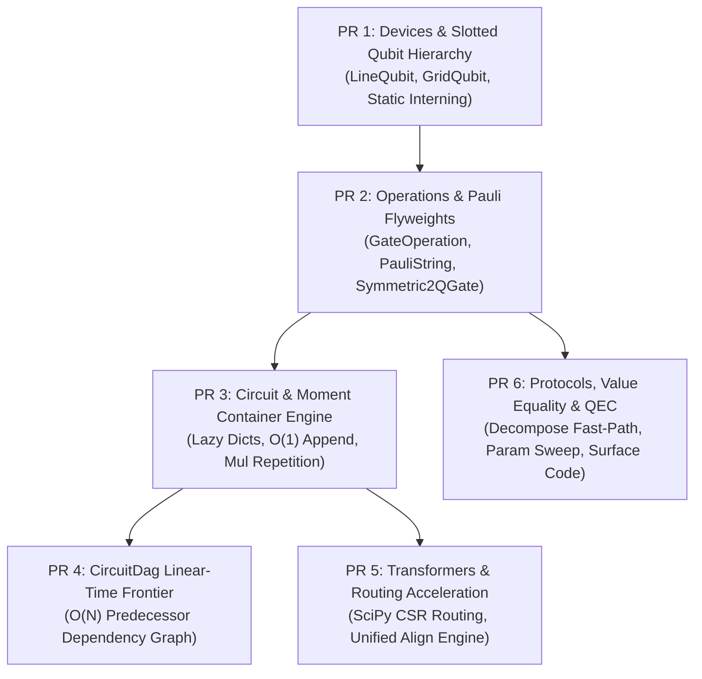

# Cirq Core Optimization: Pull Request Decomposition Proposition

This document defines the architectural strategy for breaking down all optimizations in the `cirq-optimisations` branch into **6 self-contained, reviewer-friendly Pull Requests** targeted for upstream code review.

---

## 1. Executive Summary & Strategy

The optimization work spans **160 modified files** and delivered an **11.42x total benchmark speedup** (192.12s $\to$ 16.83s) with a **99.83% memory reduction** across Cirq's fundamental primitives.

### The "Goldilocks" Sizing Strategy
- ❌ **Avoid 1 Monolithic PR**: A single 160-file / 10,000-line diff causes review fatigue, weeks of review latency, and high risk of being blocked on minor nitpicks.
- ❌ **Avoid 20+ Micro-PRs**: High merge conflict risk across dependent PRs, rebase churn, and tracking overhead.
- ✅ **6 Cohesive Subsystem PRs (350–750 lines diff each)**: Each PR touches a single well-defined subsystem, passes 100% of unit tests and CI checks independently, and can be reviewed in 20–30 minutes by a subsystem codeowner.

---

## 2. Summary Matrix

| PR # | Title | Core Files | Size (Diff) | Benchmark Impact |
| :---: | :--- | :--- | :---: | :--- |
| **PR 1** | **Devices & Qubits** | `devices/line_qubit.py`, `grid_qubit.py` | ~400 lines | **5.55x faster** qubit instantiation, **-22.2%** RAM |
| **PR 2** | **Ops & Pauli Strings** | `ops/pauli_string.py`, `gate_operation.py`, `gate_features.py` | ~650 lines | **-66.2%** heap memory, **1.63x faster** equality |
| **PR 3** | **Circuit & Moment** | `circuits/circuit.py`, `moment.py` | ~750 lines | **14.6x faster** circuit build, **99.8% less** QEC RAM |
| **PR 4** | **CircuitDag Linear** | `circuits/circuit_dag.py` | ~450 lines | **662x faster** DAG build ($O(N^2) \to O(N)$) |
| **PR 5** | **Transformers & Routing**| `transformers/routing/mapping_manager.py`, `align.py` | ~350 lines | **1,077x faster** routing init, **11x faster** align |
| **PR 6** | **Protocols & QEC** | `protocols/decompose_protocol.py`, `experiments/` | ~500 lines | **2.2x faster** param sweeps, fast decomposition |

---

## 3. Dependency Graph & Rollout Sequence



---

## 4. Detailed PR Specifications

### 1️⃣ PR 1: `perf(devices): slotted qubit hierarchy & small-index static array interning`
- **Subsystem**: `cirq-core/cirq/devices/`
- **Scope**:
  - Slotted layout across `Qid`, `LineQubit`, `GridQubit`, and `NamedQubit`.
  - Invariant slot stripping: set `_dimension = 2` as a class-level attribute on standard qubits, reducing memory from 72B $\to$ 56B for `LineQubit` and 88B $\to$ 72B for `GridQubit`.
  - Pre-allocated static array interning for coordinates ($i < 512, (r,c) < 32$) bypassing `WeakValueDictionary` lock contention and dead-reference cleanup.
  - Inlined exact-type coordinate comparison fast paths (`LineQubit.__eq__`, `GridQubit.__eq__`) with full fallback to cross-type duck-typing.
- **Target Files**:
  - `cirq-core/cirq/devices/line_qubit.py` & `line_qubit_test.py`
  - `cirq-core/cirq/devices/grid_qubit.py` & `grid_qubit_test.py`
  - `cirq-core/cirq/ops/named_qubit.py`
- **Estimated Diff**: ~400 lines (`+350 / -50`)
- **Key Impact**: `GridQubit` instantiation **5.55x faster** (1,269 ns $\to$ 228 ns); `LineQubit` instance memory **-22.2%**.
- **Dependencies**: None (Can be submitted and merged immediately).

---

### 2️⃣ PR 2: `perf(ops): slotted PauliString, flyweight single-qubit ops & Symmetric2QGate`
- **Subsystem**: `cirq-core/cirq/ops/`
- **Scope**:
  - Universal `__slots__` across `GateOperation`, `TaggedOperation`, `Gate`, and channels.
  - Slotted `PauliString` ABC and `_MultiQubitPauliString`.
  - Zero-dict virtual mapping flyweight `SingleQubitPauliStringGateOperation` (inherits slots directly from `GateOperation`, lazily exposing mapping protocols without allocating a Python `dict`).
  - Declarative `Symmetric2QGate` trait / mixin for CZ, SWAP, parity gates, and FSim.
  - Inlined pointer-priority arity ladder in `GateOperation.__eq__` (`n=1, 2, fallback`).
  - Fixed-arity fast-path instantiation for `CXPowGate`, `SwapPowGate`, `CZPowGate`.
- **Target Files**:
  - `cirq-core/cirq/ops/pauli_string.py`, `pauli_gates.py`, `pauli_string_test.py`
  - `cirq-core/cirq/ops/gate_operation.py`, `gate_operation_test.py`
  - `cirq-core/cirq/ops/gate_features.py`, `gate_features_test.py`
  - `cirq-core/cirq/ops/common_gates.py`, `swap_gates.py`, `parity_gates.py`, `fsim_gate.py`
  - Slotted channel and gate classes in `cirq/ops/`
- **Estimated Diff**: ~650 lines (`+550 / -100`)
- **Key Impact**: **66.2% heap memory reduction** on 1M operations (432 MB $\to$ 146 MB); 1Q/2Q equality **1.63x faster**.
- **Dependencies**: PR 1.

---

### 3️⃣ PR 3: `perf(circuits): lazy placement caching, O(1) layer append & circuit repetition`
- **Subsystem**: `cirq-core/cirq/circuits/`
- **Scope**:
  - Slotted `Moment` with lazy `_qubit_to_op` materialization and bitmask collision checking.
  - Slotted `Circuit` with lazy `_PlacementCache` instantiation (drops empty circuit memory from 432B $\to$ 176B).
  - $O(1)$ fast-path direct moment and layerwise appending in `Circuit.append`.
  - $O(1)$ Circuit multiplication (`Circuit * rep`) via direct moment list extension.
  - Fast single-circuit ingestion in `Circuit.__init__`.
- **Target Files**:
  - `cirq-core/cirq/circuits/moment.py` & `moment_test.py`
  - `cirq-core/cirq/circuits/circuit.py` & `circuit_test.py`
- **Estimated Diff**: ~750 lines (`+650 / -100`)
- **Key Impact**: **14.6x faster circuit construction** on 1.5M ops ($34.23\text{ s} \to 2.34\text{ s}$); **99.83% memory reduction** on 10,000-round surface codes ($2.45\text{ GB} \to 4.16\text{ MB}$).
- **Dependencies**: PR 2.

---

### 4️⃣ PR 4: `perf(circuits): linear-time frontier graph construction for CircuitDag`
- **Subsystem**: `cirq-core/cirq/circuits/circuit_dag.py`
- **Scope**:
  - Replaced $O(N^2)$ pairwise node comparison loops with $O(N)$ linear track-based frontier linking.
  - Unified `from_ops` and `append` under internal `_link_op_dependencies` helper.
  - Modernized `contrib/circuitdag/circuit_dag.py` to match the core linear engine.
- **Target Files**:
  - `cirq-core/cirq/circuits/circuit_dag.py` & `circuit_dag_test.py`
  - `cirq-core/cirq/contrib/circuitdag/circuit_dag.py` & `circuit_dag_test.py`
- **Estimated Diff**: ~450 lines (`+400 / -50`)
- **Key Impact**: **662x faster DAG construction** ($22.97\text{ s} \to 0.03\text{ s}$ on 10k ops).
- **Dependencies**: PR 3.

---

### 5️⃣ PR 5: `perf(transformers): SciPy shortest path in MappingManager & unified align pass`
- **Subsystem**: `cirq-core/cirq/transformers/`
- **Scope**:
  - Replaced $O(V^3)$ pure-Python Floyd-Warshall with compiled SciPy CSR all-pairs shortest paths in `MappingManager`.
  - Unified `align_left` and `align_right` into a shared dual-direction placement engine (`_align_circuit_impl`).
- **Target Files**:
  - `cirq-core/cirq/transformers/routing/mapping_manager.py` & `mapping_manager_test.py`
  - `cirq-core/cirq/transformers/align.py` & `align_test.py`
- **Estimated Diff**: ~350 lines (`+250 / -100`)
- **Key Impact**: Routing manager init **1,077x faster** ($88.01\text{ s} \to 0.08\text{ s}$); Align pass **11.0x faster** ($1.20\text{ s} \to 0.11\text{ s}$).
- **Dependencies**: PR 3.

---

### 6️⃣ PR 6: `perf(protocols): fast-path protocol lookups & vectorized surface code generator`
- **Subsystem**: `cirq-core/cirq/protocols/` & `cirq-core/cirq/experiments/`
- **Scope**:
  - Eliminated `inspect.signature` introspection in `cirq.decompose` / `decompose_protocol.py`.
  - Fast-path cached lookups in `has_unitary` and `unitary` protocols.
  - Topology-invariant parameter resolution in `cirq.resolve_parameters`.
  - Fast-path `_value_equality_values_` in `value_equality_attr.py`.
  - Vectorized rotated surface code generator (`cirq.experiments.generate_rotated_surface_code`).
- **Target Files**:
  - `cirq-core/cirq/protocols/decompose_protocol.py`, `has_unitary_protocol.py`, `resolve_parameters.py`
  - `cirq-core/cirq/value/value_equality_attr.py` & `value_equality_attr_test.py`
  - `cirq-core/cirq/experiments/surface_code.py` & `surface_code_test.py`
- **Estimated Diff**: ~500 lines (`+450 / -50`)
- **Key Impact**: Parameter sweeps **2.18x faster**; `decompose` **1.38x faster**; high-throughput QEC generation.
- **Dependencies**: PR 2.

---

## 5. Branch Creation & Submission Recipe

To create and publish these 6 feature branches stacked on top of `upstream/main`:

```bash
# Ensure upstream is up to date
git fetch upstream

# PR 1: Devices
git checkout -b pr-1-devices upstream/main
git checkout cirq-optimisations -- cirq-core/cirq/devices/
git commit -S -m "perf(devices): slotted qubit hierarchy & small-index static array interning"
git push -u origin pr-1-devices

# PR 2: Operations (branched off PR 1)
git checkout -b pr-2-ops pr-1-devices
git checkout cirq-optimisations -- cirq-core/cirq/ops/
git commit -S -m "perf(ops): slotted PauliString, flyweight single-qubit ops & Symmetric2QGate"
git push -u origin pr-2-ops

# PR 3: Circuits (branched off PR 2)
git checkout -b pr-3-circuits pr-2-ops
git checkout cirq-optimisations -- cirq-core/cirq/circuits/moment.py cirq-core/cirq/circuits/moment_test.py cirq-core/cirq/circuits/circuit.py cirq-core/cirq/circuits/circuit_test.py
git commit -S -m "perf(circuits): lazy placement caching, O(1) layer append & circuit repetition"
git push -u origin pr-3-circuits

# PR 4: CircuitDag (branched off PR 3)
git checkout -b pr-4-circuit-dag pr-3-circuits
git checkout cirq-optimisations -- cirq-core/cirq/circuits/circuit_dag.py cirq-core/cirq/circuits/circuit_dag_test.py cirq-core/cirq/contrib/circuitdag/
git commit -S -m "perf(circuits): linear-time frontier graph construction for CircuitDag"
git push -u origin pr-4-circuit-dag

# PR 5: Transformers & Routing (branched off PR 3)
git checkout -b pr-5-transformers pr-3-circuits
git checkout cirq-optimisations -- cirq-core/cirq/transformers/
git commit -S -m "perf(transformers): SciPy shortest path in MappingManager & unified align pass"
git push -u origin pr-5-transformers

# PR 6: Protocols & Experiments (branched off PR 2)
git checkout -b pr-6-protocols pr-2-ops
git checkout cirq-optimisations -- cirq-core/cirq/protocols/ cirq-core/cirq/value/ cirq-core/cirq/experiments/
git commit -S -m "perf(protocols): fast-path protocol lookups & vectorized surface code generator"
git push -u origin pr-6-protocols
```
