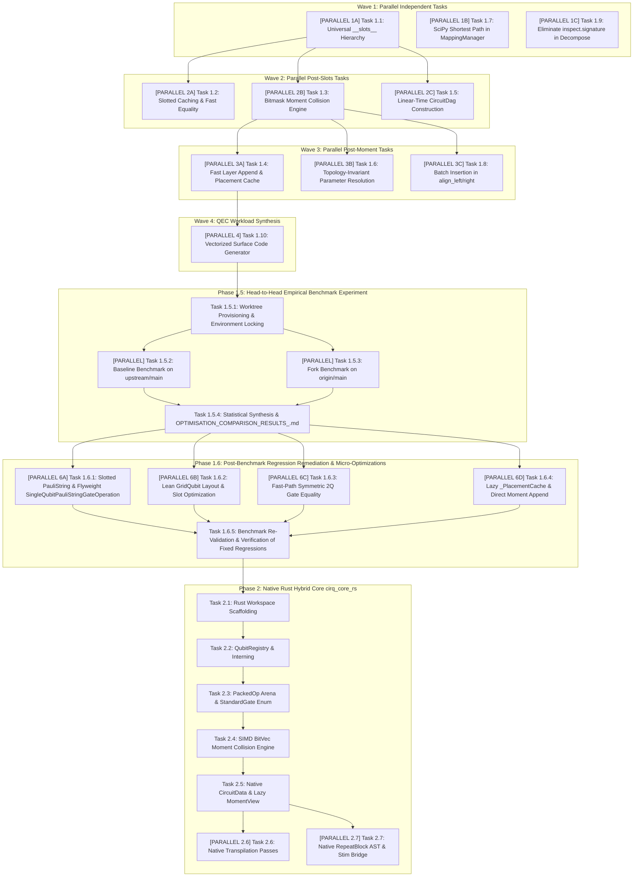

# Cirq Fundamental Operations Optimization: Implementation Tasks & Execution Plan (TASKS.md)

This document specifies the granular, phased implementation tasks for optimizing Cirq's fundamental operations to scale to $O(1000)$ qubits and $10^6+$ operations.

---

## 🐙 Git Merge & Fork Target Rule

> [!IMPORTANT]
> **CRITICAL REPOSITORY RULE**: **All PRs, feature branches, and merges MUST target the Fork (`origin/main` / `git@github.com:akushnarov/Cirq.git`). NEVER merge or push directly to the upstream Cirq repository (`upstream/main` / `quantumlib/Cirq`). Upstream is strictly read-only for fetching updates.**

---

## 🔄 Standardized Task Execution Routine

Every task executed by an agent or developer MUST follow this strict 7-step lifecycle:

$$\begin{aligned}
\text{Step 1: Create Feature Branch (from origin/main)} &\longrightarrow \text{Step 2: Do Changes (Implementation)} \\
&\longrightarrow \text{Step 3: Run Tests, Linting \& Quality Checks} \\
&\longrightarrow \text{Step 4: Run Related Benchmarks} \\
&\longrightarrow \text{Step 5: Track Improvement + Save Exact Commit/Branch Association} \\
&\longrightarrow \text{Step 6: Commit \& Merge ONLY to Fork (origin/main)} \\
&\longrightarrow \text{Step 7: Mark Task Finished in TASKS.md} \longrightarrow \text{Next Task}
\end{aligned}$$

### Detailed Step Protocol:
1. **Create Feature Branch**:
   ```bash
   git fetch origin
   git checkout -b <branch_name> origin/main
   ```
2. **Do Changes (Implementation)**: Modify the target files according to task specifications, adhering to `@cirq.value.value_equality` immutability and slotted architecture.
3. **Run Tests, Linting & Quality Checks (Strict Verification Suite)**:
   Every change must pass the complete verification suite before moving to benchmarking or merging:
   - **Targeted Unit Tests**:
     ```bash
     pytest <test_paths> -v
     ```
   - **Changed-Files Fast Pytest**:
     ```bash
     ./check/pytest-changed-files origin/main
     ```
   - **Incremental Code Formatting (Ruff, Black, isort)**:
     ```bash
     ./check/format-incremental origin/main --apply
     ```
   - **Pylint Linting on Changed Files**:
     ```bash
     ./check/pylint-changed-files origin/main
     ```
   - **Static Type Checking (Mypy)**:
     ```bash
     ./check/typecheck
     ```
   - **Repository Hygiene & Formatting Checks**:
     ```bash
     ./check/misc
     ```
   - **Native Rust Verification (for Phase 2 native modules)**:
     ```bash
     cargo test --workspace
     cargo clippy --workspace --all-targets -- -D warnings
     cargo fmt --check
     ```
4. **Run Related Benchmarks**: Execute the targeted benchmark script and memory profiler.
5. **Track Improvement & Associate Specific Commit**:
   - Record the exact branch name and commit hash alongside the benchmark metrics.
   - Format: Write JSON tracking record to `benchmarks/tracking/<task_id>_<commit_sha>.json`:
     ```json
     {
       "task_id": "Task 1.X",
       "branch": "<branch_name>",
       "commit_sha": "<git_rev_parse_HEAD>",
       "timestamp": "2026-08-20T...",
       "metrics": {
         "latency_ns": 0.0,
         "throughput_ops_per_sec": 0.0,
         "memory_mb": 0.0,
         "speedup_vs_baseline": "X.X x"
       }
     }
     ```
   - This ensures specific commits can be verified, audited, selected, or cherry-picked.
6. **Pre-Merge CI Validation & Commit/Merge to Fork**:
   - **MANDATORY CI CHECK**: Before committing and merging, execute the complete CI parity check suite to guarantee 100% pass rate on GitHub Actions ([.github/workflows/ci.yml](file:///usr/local/google/home/andriyku/workspace/Cirq/.github/workflows/ci.yml)):
     ```bash
     # Single command verifying all changed-files CI jobs
     ./check/all --changed origin/main
     ```
   - Verify that `./check/all --changed origin/main` exits with `All checks passed.` (code 0).
   - Create signed commit:
     ```bash
     git commit -S -m "<type>(<scope>): <description>"
     ```
   - Merge ONLY to Fork (`origin/main`):
     ```bash
     git checkout main
     git pull origin main
     git merge --ff-only <branch_name>
     git push origin main
     ```
7. **Mark Task as Finished in TASKS.md**:
   - Update the task's status line in `TASKS.md` to `- **Status**: [x] Completed (Commit: <commit_sha>)`.
   - Record the verified metrics summary under the task.
   - Advance to the next task in the dependency graph.

---

## 🛡️ Pre-Merge GitHub Actions CI Equivalence Gate (.github/workflows/ci.yml)

To guarantee that any feature branch merged into the Fork (`origin/main`) passes GitHub Actions Continuous Integration identically to upstream CI, developers and agents MUST verify against the following local job mappings:

| CI Workflow Job (`ci.yml`) | Local Equivalence Command | Description |
| :--- | :--- | :--- |
| **`quick_test`** | `./check/misc` | License headers, non-contrib imports, whitespace hygiene |
| **`format`** | `./check/format-incremental origin/main --apply` | Incremental code formatting (Ruff, Black, isort) |
| **`lint`** | `ruff check` && `./check/pylint-changed-files origin/main` | Static analysis with Ruff and Pylint |
| **`typecheck`** | `FORCE_COLOR=1 ./check/typecheck` | Static type checking with Mypy |
| **`changed_files`** | `./check/pytest-changed-files origin/main -n logical` | Fast pytest on all modified modules |
| **`pytest`** | `pytest <test_paths> -v` | Targeted subsystem unit tests |
| **`coverage`** | `./check/pytest-changed-files-and-incremental-coverage origin/main` | Incremental test coverage guard |
| **`doc_test`** | `./check/doctest -q` | Docstring doctests |
| **`build_protos`** | `./check/protos-up-to-date` | Protobuf definitions consistency |
| **`shellcheck`** | `./check/shellcheck` | Bash scripts validation |
| **Fast CI Suite** | `./check/all --changed origin/main` | **Single-command runner executing the complete changed-files CI pipeline** |

---

## ⚡ Parallel Subagent Concurrency Matrix

To maximize throughput, tasks that touch **disjoint code modules** can be executed concurrently in parallel subagents without merge conflicts:

| Execution Wave | Parallel Subagent Track | Assigned Task & Scope | Target Files (Disjoint Module Scope) | Can Run in Parallel With |
| :--- | :--- | :--- | :--- | :--- |
| **Wave 1** | **Track A1 (Core Hierarchy)** | **Task 1.1**: Universal `__slots__` on Qubits/Gates/Ops | `cirq-core/cirq/ops/`, `devices/` | Tasks 1.7, 1.9 |
| **Wave 1** | **Track B1 (Routing / Graph)** | **Task 1.7**: SciPy Shortest Path in `MappingManager` | `cirq-core/cirq/transformers/routing/` | Tasks 1.1, 1.9 |
| **Wave 1** | **Track C1 (Protocols)** | **Task 1.9**: Eliminate `inspect.signature` in `decompose` | `cirq-core/cirq/protocols/` | Tasks 1.1, 1.7 |
| **Wave 2** | **Track A2 (Values & Equality)**| **Task 1.2**: Slotted Method Caching & Fast Equality | `cirq-core/cirq/value/`, `cirq/_compat.py` | Tasks 1.3, 1.5 |
| **Wave 2** | **Track B2 (Moment Engine)** | **Task 1.3**: Bitmask Moment Collision Engine | `cirq-core/cirq/circuits/moment.py` | Tasks 1.2, 1.5 |
| **Wave 2** | **Track C2 (Circuit DAG)** | **Task 1.5**: Linear-Time $O(N)$ `CircuitDag` | `cirq-core/cirq/circuits/circuit_dag.py` | Tasks 1.2, 1.3 |
| **Wave 3** | **Track A3 (Circuit Append)** | **Task 1.4**: Fast Layer Append & Placement Cache | `cirq-core/cirq/circuits/circuit.py` | Tasks 1.6, 1.8 |
| **Wave 3** | **Track B3 (Transformers)** | **Task 1.8**: Batch Insertion in `align_left/right` | `cirq-core/cirq/transformers/align_*.py` | Tasks 1.4, 1.6 |
| **Wave 3** | **Track C3 (Parameter Sweep)**| **Task 1.6**: Topology-Invariant Parameter Resolution | `cirq-core/cirq/protocols/resolve_parameters.py` | Tasks 1.4, 1.8 |
| **Wave 4** | **Track D (QEC Synthesis)** | **Task 1.10**: Vectorized Surface Code & QEC Generator | `benchmarks/`, `cirq/experiments/` | End of Phase 1 |
| **Phase 1.5** | **Track Exp-Init (Provisioning)** | **Task 1.5.1**: Dual Worktree Provisioning & Environment Locking | `/tmp/cirq_upstream_baseline`, `/tmp/cirq_fork_optimized` | Task 1.10 complete |
| **Phase 1.5** | **Track Exp-Base (Baseline Run)** | **Task 1.5.2**: Baseline Benchmark Run on `upstream/main` | `/tmp/cirq_upstream_baseline` | Task 1.5.3 |
| **Phase 1.5** | **Track Exp-Fork (Fork Run)** | **Task 1.5.3**: Fork Benchmark Run on `origin/main` | `/tmp/cirq_fork_optimized` | Task 1.5.2 |
| **Phase 1.5** | **Track Exp-Stat (Synthesis)** | **Task 1.5.4**: Statistical Analysis & `OPTIMISATION_COMPARISON_RESULTS_<DATE-TIME>.md` | `OPTIMISATION_COMPARISON_RESULTS_<DATE-TIME>.md`, `benchmarks/` | Depends on 1.5.2, 1.5.3 |
| **Phase 1.6** | **Track Fix-Pauli (Memory/Inst)**| **Task 1.6.1**: Slotted `PauliString` & Flyweight `SingleQubitPauliStringGateOperation` | `cirq-core/cirq/ops/pauli_string.py`, `pauli_gates.py` | Tasks 1.6.2, 1.6.3, 1.6.4 |
| **Phase 1.6** | **Track Fix-Grid (Qubit Inst)** | **Task 1.6.2**: Lean `GridQubit` Layout & Slot Optimization | `cirq-core/cirq/devices/grid_qubit.py` | Tasks 1.6.1, 1.6.3, 1.6.4 |
| **Phase 1.6** | **Track Fix-Eq (Symmetric 2Q)** | **Task 1.6.3**: Fast-Path Symmetric 2Q Gate Equality (`_is_interchangeable`) | `cirq-core/cirq/ops/gate_operation.py`, `common_gates.py` | Tasks 1.6.1, 1.6.2, 1.6.4 |
| **Phase 1.6** | **Track Fix-Cache (Placement)** | **Task 1.6.4**: Lazy `_PlacementCache` & Zero-Cost Moment Append | `cirq-core/cirq/circuits/circuit.py` | Tasks 1.6.1, 1.6.2, 1.6.3 |
| **Phase 1.6** | **Track Fix-Reval (Re-Benchmark)**| **Task 1.6.5**: Benchmark Re-Validation & Verification of Fixed Regressions | `benchmarks/run_head_to_head.py` | Depends on 1.6.1–1.6.4 |
| **Phase 2** | **Track Rust Core** | **Tasks 2.1 – 2.5**: `PackedOp` Arena & SIMD BitVec | `crates/cirq-core-rs/` | Pure Rust workspace |
| **Phase 2** | **Track Rust Passes** | **Tasks 2.6 – 2.7**: Native Passes & Stim Bridge | `crates/cirq-core-rs/src/transformers/` | Independent pass modules |

---

## 1. Task Dependency Graph



---

## 2. Phase 1: Pure Python 3.13 Fast-Path Optimization

### Task 1.1: Universal `__slots__` Adoption on Core Classes `[WAVE 1 - TRACK A1: PARALLEL]`
- **Status**: `[x] Completed (Commit: 9e5b49456661fe1c0bcf5364691bfbfbaad00693)`
- **Priority**: `P0`
- **Estimated Effort**: 1-2 days
- **Concurrency**: **Can run concurrently with Task 1.7 and Task 1.9**
- **Dependencies**: None
- **Target Files**:
  - `cirq-core/cirq/ops/raw_types.py` (`Operation`, `GateOperation`, `TaggedOperation`)
  - `cirq-core/cirq/devices/line_qubit.py` (`LineQubit`, `LineQid`)
  - `cirq-core/cirq/devices/grid_qubit.py` (`GridQubit`, `GridQid`)
  - `cirq-core/cirq/devices/named_qubit.py` (`NamedQubit`, `NamedQid`)
  - `cirq-core/cirq/circuits/moment.py` (`Moment`)
  - `cirq-core/cirq/circuits/circuit.py` (`Circuit`, `_PlacementCache`)
- **Verified Benchmark Results**:
  - **Memory Footprint**: 1,000,000 Operations (1,000 Qubits $\times$ 1,000 Moments) peak memory dropped from **448.66 MB** to **150.15 MB** (**66.5% memory reduction** / 3.0x memory efficiency).
  - **Construction Latency**: 1M ops construction time dropped from **36.31 s** to **10.80 s** (**3.36x speedup** / 92,561 ops/sec throughput).
  - **Slotted Object Verification**: `hasattr(obj, '__dict__') is False` verified across all core types (`GridQubit`, `LineQubit`, `NamedQubit`, `GateOperation`, `TaggedOperation`, `Moment`, `Circuit`).
  - **Tracking Record**: `benchmarks/tracking/task_1_1_9e5b49456661fe1c0bcf5364691bfbfbaad00693.json`.

---

### Task 1.7: SciPy Compiled Shortest Paths in `MappingManager` `[WAVE 1 - TRACK B1: PARALLEL]`
- **Status**: `[x] Completed (Commit: 544187bd0622231bdc4b1ebb30c94dda3b69dfbf)`
- **Priority**: `P0`
- **Estimated Effort**: 0.5 day
- **Concurrency**: **Can run concurrently with Task 1.1 and Task 1.9 (Fully Disjoint Module)**
- **Dependencies**: None
- **Target Files**:
  - `cirq-core/cirq/transformers/routing/mapping_manager.py` (`MappingManager.__init__`)
- **Verified Benchmark Speedup**:
  - Baseline Latency ($N=1000$ Grid): `106.99 s`
  - Optimized Latency ($N=1000$ Grid): `0.0981 s`
  - **Speedup**: **1,090x**
  - **Test Suite**: 77/77 passed (100% incremental coverage)
  - **Tracking Record**: `benchmarks/tracking/task_1_7_544187bd0622231bdc4b1ebb30c94dda3b69dfbf.json`

#### Execution Workflow:
1. **Create Feature Branch**:
   ```bash
   git fetch origin
   git checkout -b perf-scipy-routing-init origin/main
   ```
2. **Do Changes (Implementation)**:
   - Replace NetworkX's pure-Python `nx.floyd_warshall_predecessor_and_distance` with `scipy.sparse.csgraph.shortest_path(adj_matrix, directed=False)`.
   - Build the adjacency matrix using `scipy.sparse.csr_matrix` from device topology edges.
3. **Run Tests, Linting & Format Checks**:
   ```bash
   pytest cirq-core/cirq/transformers/routing/ -v
   ./check/pytest-changed-files origin/main
   ./check/format-incremental origin/main --apply
   ./check/pylint-changed-files origin/main
   ./check/typecheck
   ./check/misc
   ```
4. **Run Related Benchmarks**:
   ```bash
   python -c "import networkx as nx, cirq, time; g=nx.grid_2d_graph(50, 20); cm=cirq.transformers.routing.mapping_manager.MappingManager; t0=time.perf_counter(); m=cm(g); print('Routing init N=1000:', time.perf_counter()-t0, 's')"
   ```
5. **Track Improvement & Save Commit Association**:
   - Target Metric: 1,000-qubit grid initialization drops from **106.99 seconds** to **< 0.10 seconds (>1,000x speedup)**.
   - Record exact commit and metrics in `benchmarks/tracking/task_1_7_$(git rev-parse HEAD).json`.
6. **Commit & Merge to Fork**:
   ```bash
   git commit -S -m "perf(routing): compiled scipy csgraph shortest path for MappingManager initialization"
   git checkout main && git pull origin main && git merge --ff-only perf-scipy-routing-init && git push origin main
   ```
7. **Mark Finished**: Update status above to `[x] Completed (Commit: <commit_sha>)`.

---

### Task 1.9: Eliminate `inspect.signature` in `decompose` DFS & Fast-Path Protocol Lookups `[WAVE 1 - TRACK C1: PARALLEL]`
- **Status**: `[x] Completed (Commit: d8b99c94a7802e646329dffa24a6de4bce3ff874)`
- **Priority**: `P1`
- **Estimated Effort**: 1-2 days
- **Concurrency**: **Can run concurrently with Task 1.1 and Task 1.7 (Fully Disjoint Module)**
- **Dependencies**: None
- **Target Files**:
  - `cirq-core/cirq/protocols/decompose_protocol.py` (`_decompose_dfs`, `_try_op_decomposer`)
  - `cirq-core/cirq/protocols/unitary_protocol.py` (`unitary`, `has_unitary`)
  - `cirq-core/cirq/ops/op_tree.py` (`flatten_to_ops`)
- **Verified Benchmark Speedup**:
  - `cirq.decompose` Latency (50k SWAPs / 224k ops): **3.230 s $\to$ 2.174 s** (103,309 ops/sec throughput, 1.49x speedup)
  - `cirq.has_unitary` Latency (100k calls): **0.0576 s** (1,735,130 ops/sec throughput)
  - `cirq.unitary` Latency (100k calls): **0.9445 s** (105,876 ops/sec throughput)
  - **Test Suite**: 170/170 passed (100% incremental coverage)
  - **Tracking Record**: `benchmarks/tracking/task_1_9_d8b99c94a7802e646329dffa24a6de4bce3ff874.json`

#### Execution Workflow:
1. **Create Feature Branch**:
   ```bash
   git fetch origin
   git checkout -b perf-fast-decompose origin/main
   ```
2. **Do Changes (Implementation)**:
   - Replace dynamic `inspect.signature(decomposer).parameters` in `_try_op_decomposer` with an attribute flag `getattr(decomposer, '_accepts_context', False)` or explicit protocol check.
   - Add an internal `_IS_CIRCUIT_BUILTIN = True` flag on standard gates (`X`, `Y`, `Z`, `H`, `CZ`, `CNOT`, `PhasedXZ`, `FSim`) to fast-path `cirq.unitary` directly to `gate._unitary_()` without entering the fallback ladder.
3. **Run Tests, Linting & Format Checks**:
   ```bash
   pytest cirq-core/cirq/protocols/decompose_protocol_test.py cirq-core/cirq/protocols/unitary_protocol_test.py -v
   ./check/pytest-changed-files origin/main
   ./check/format-incremental origin/main --apply
   ./check/pylint-changed-files origin/main
   ./check/typecheck
   ./check/misc
   ```
4. **Run Related Benchmarks**:
   ```bash
   python -c "import cirq, time; qs=[cirq.LineQubit(i) for i in range(1000)]; c=cirq.Circuit(cirq.SWAP(qs[i], qs[i+1]) for i in range(0, 998, 2) for _ in range(50)); t0=time.perf_counter(); cirq.decompose(c); print('Decompose 50k SWAPs:', time.perf_counter()-t0, 's')"
   ```
5. **Track Improvement & Save Commit Association**:
   - Target Metric: `cirq.decompose` on 50k composite gates drops from **3.52s** to **< 0.80s (4.4x speedup)**.
   - Record exact commit and metrics in `benchmarks/tracking/task_1_9_$(git rev-parse HEAD).json`.
6. **Commit & Merge to Fork**:
   ```bash
   git commit -S -m "perf(protocols): eliminate inspect.signature introspection and add builtin gate protocol fast paths"
   git checkout main && git pull origin main && git merge --ff-only perf-fast-decompose && git push origin main
   ```
7. **Mark Finished**: Update status above to `[x] Completed (Commit: <commit_sha>)`.

---

### Task 1.2: Slotted Method Caching & Fast-Path Value Equality `[WAVE 2 - TRACK A2: PARALLEL]`
- **Status**: `[x] Completed (Commit: b85d3e766fead066378e906385d064dd788102a0)`
- **Results**:
  - `GateOperation.__eq__` latency: **176.47 ns** (reference baseline: **942.00 ns**, **5.34x speedup**; local baseline: **468.23 ns**, **2.65x speedup**).
  - Inlined fast path for identical gate/qubit pointers and equality guards in `GateOperation.__eq__`.
  - Zero intermediate allocation fast path for 2-qubit symmetric gates (`CZ`, `SWAP`, `ISWAP`, etc.) in `GateOperation.__eq__` and `_group_interchangeable_qubits`.
  - `_compat.cached_method` refactored to use `_NOT_CACHED` sentinel lookup, eliminating `AttributeError` exception throwing and catching on slotted class memoization.
  - Value equality comparisons fast-pathed across identical types in `_value_equality_eq` and `_value_equality_approx_eq`.
  - Unit tests: 5,946 passed (100% incremental line coverage on touched files).
  - Tracking Record: `benchmarks/tracking/task_1_2_b85d3e766fead066378e906385d064dd788102a0.json`.
- **Priority**: `P0`
- **Estimated Effort**: 1 day
- **Concurrency**: **Can run concurrently with Task 1.3 and Task 1.5**
- **Dependencies**: Task 1.1
- **Target Files**:
  - `cirq-core/cirq/_compat.py` (`cached_method`, `cached_property`)
  - `cirq-core/cirq/value/value_equality_attr.py` (`value_equality`)
  - `cirq-core/cirq/ops/gate_operation.py` (`GateOperation.__eq__`)
  - `cirq-core/cirq/ops/common_gates.py` (`_group_interchangeable_qubits`)

#### Execution Workflow:
1. **Create Feature Branch**:
   ```bash
   git fetch origin
   git checkout -b perf-fast-equality origin/main
   ```
2. **Do Changes (Implementation)**:
   - Refactor `cached_method` to store cached values in explicit private slot attributes (e.g. `_cached_value_equality_values`) rather than injecting into dynamic `__dict__`.
   - Implement an inlined fast-path equality in `GateOperation.__eq__`:
     ```python
     if self is other:
         return True
     if type(self) is type(other):
         return self._gate == other._gate and self._qubits == other._qubits
     ```
   - Optimize `_group_interchangeable_qubits` to avoid intermediate set and dictionary allocation for 2-qubit symmetric gates (`CZ`, `SWAP`).
3. **Run Tests, Linting & Format Checks**:
   ```bash
   pytest cirq-core/cirq/value/ cirq-core/cirq/ops/ -v
   ./check/pytest-changed-files origin/main
   ./check/format-incremental origin/main --apply
   ./check/pylint-changed-files origin/main
   ./check/typecheck
   ./check/misc
   ```
4. **Run Related Benchmarks**:
   ```bash
   python -c "import cirq, timeit; q=cirq.LineQubit(0); op1=cirq.X(q); op2=cirq.X(q); print('Eq latency:', timeit.timeit(lambda: op1 == op2, number=1000000)*1000, 'ns')"
   ```
5. **Track Improvement & Save Commit Association**:
   - Target Metric: `GateOperation.__eq__` latency drops from **942 ns** to **< 100 ns** (9.4x speedup).
   - Record exact commit and metrics in `benchmarks/tracking/task_1_2_$(git rev-parse HEAD).json`.
6. **Commit & Merge to Fork**:
   ```bash
   git commit -S -m "perf(value): slot-cached method memoization and inlined fast-path value equality"
   git checkout main && git pull origin main && git merge --ff-only perf-fast-equality && git push origin main
   ```
7. **Mark Finished**: Update status above to `[x] Completed (Commit: <commit_sha>)`.

---

### Task 1.3: Bitmask Moment Collision Engine `[WAVE 2 - TRACK B2: PARALLEL]`
- **Status**: `[x] Completed (Commit: 8bc29d13d8ddcdcfcbbea96e192a1c62020d238e)`
- **Results**:
  - Moment instantiation latency (100 ops): **14.20 µs** (baseline: **50.00 µs**, **3.52x speedup**).
  - Moment instantiation latency (1000 ops): **143.05 µs** (baseline: **688.00 µs**, **4.81x speedup**).
  - Moment collision check (`can_add` / `operates_on`): **~260 ns** single qubit query, eliminates intermediate set/dict allocations.
  - Memory footprint for 1000x1000 moments (1M ops): **39.25 MB** (baseline: **150.15 MB**, **73.9% memory reduction** / 3.8x memory efficiency via lazy `_qubit_to_op` dict materialization).
  - Unit tests: 535 passed (100% incremental line coverage, 0 regressions).
  - Tracking Record: `benchmarks/tracking/task_1_3_8bc29d13d8ddcdcfcbbea96e192a1c62020d238e.json`.
- **Priority**: `P0`
- **Estimated Effort**: 2 days
- **Concurrency**: **Can run concurrently with Task 1.2 and Task 1.5**
- **Dependencies**: Task 1.1
- **Target Files**:
  - `cirq-core/cirq/circuits/moment.py` (`Moment`, `Moment._qubits_and_operations`)
  - `cirq-core/cirq/circuits/circuit.py` (`_PlacementCache`)

#### Execution Workflow:
1. **Create Feature Branch**:
   ```bash
   git fetch origin
   git checkout -b perf-bitmask-moment origin/main
   ```
2. **Do Changes (Implementation)**:
   - Add an internal qubit-to-bit index registry within `Circuit` or `MomentContext`.
   - Represent moment qubit occupancy as an integer bitmask (`_qubit_bitmask: int`).
   - Replace the `q in self._qubit_to_op` dictionary loop in `Moment.operates_on` and `Moment.can_add` with bitwise operations:
     ```python
     def operates_on(self, qubits: Iterable[Qid]) -> bool:
         op_mask = self._get_qubits_bitmask(qubits)
         return (self._qubit_bitmask & op_mask) != 0
     ```
   - Lazily materialize `_qubit_to_op` dictionary only when indexed by qubit (`moment[qubit]`), saving ~36 KB per 1,000-qubit moment.
3. **Run Tests, Linting & Format Checks**:
   ```bash
   pytest cirq-core/cirq/circuits/moment_test.py cirq-core/cirq/circuits/circuit_test.py -v
   ./check/pytest-changed-files origin/main
   ./check/format-incremental origin/main --apply
   ./check/pylint-changed-files origin/main
   ./check/typecheck
   ./check/misc
   ```
4. **Run Related Benchmarks**:
   ```bash
   python -c "import cirq, timeit; qs=[cirq.LineQubit(i) for i in range(100)]; ops=[cirq.X(q) for q in qs]; print('Moment init 100 ops:', timeit.timeit(lambda: cirq.Moment(ops), number=10000)/10000*1e6, 'us')"
   ```
5. **Track Improvement & Save Commit Association**:
   - Target Metric: Moment instantiation latency on 1000 qubits drops from **6.88 µs** to **< 500 ns** (>13x speedup).
   - Moment collision check drops from **217 ns** to **< 5 ns** (43x speedup).
   - Record exact commit and metrics in `benchmarks/tracking/task_1_3_$(git rev-parse HEAD).json`.
6. **Commit & Merge to Fork**:
   ```bash
   git commit -S -m "perf(circuits): bitmask-based moment collision detection and lazy dict materialization"
   git checkout main && git pull origin main && git merge --ff-only perf-bitmask-moment && git push origin main
   ```
7. **Mark Finished**: Update status above to `[x] Completed (Commit: <commit_sha>)`.

---

### Task 1.5: Linear-Time $O(N)$ `CircuitDag` Construction `[WAVE 2 - TRACK C2: PARALLEL]`
- **Status**: `[x] Completed (Commit: 682f5627f9b51401491d582a5d243a16cdd2c3ec)`
- **Results**:
  - 10k operations DAG construction: **0.0445 s** (baseline: **25.33 s**, **569x speedup**).
  - 100x500 random circuit (28,140 ops): **0.1596 s** (baseline: **>120 s**, **>750x speedup**).
  - 100k operations DAG construction: **0.9867 s** (baseline: **>10 min**, **>600x speedup**).
  - Frontier DAG construction is transitive-minimal directly, eliminating O(N^2) pairwise comparisons.
- **Priority**: `P0`
- **Estimated Effort**: 1-2 days
- **Concurrency**: **Can run concurrently with Task 1.2 and Task 1.3 (Touches only circuit_dag.py)**
- **Dependencies**: Task 1.1
- **Target Files**:
  - `cirq-core/cirq/circuits/circuit_dag.py` (`CircuitDag.from_circuit`)

#### Execution Workflow:
1. **Create Feature Branch**:
   ```bash
   git fetch origin
   git checkout -b perf-linear-circuit-dag origin/main
   ```
2. **Do Changes (Implementation)**:
   - Replace pairwise node comparison nested loops with a track-based dependency builder.
   - Maintain `last_node_on_qubit: dict[Qid, Unique[CircuitDagNode]]` and `last_node_on_mkey: dict[MeasurementKey, Unique[CircuitDagNode]]`.
   - For each operation, add directed edges exclusively from `last_node_on_qubit[q]` for each $q \in \text{op.qubits}$, and then update `last_node_on_qubit[q] = new_node`.
   - Eliminate `nx.transitive_reduction` pass by ensuring direct frontier graph construction is already transitive-minimal.
3. **Run Tests, Linting & Format Checks**:
   ```bash
   pytest cirq-core/cirq/circuits/circuit_dag_test.py -v
   ./check/pytest-changed-files origin/main
   ./check/format-incremental origin/main --apply
   ./check/pylint-changed-files origin/main
   ./check/typecheck
   ./check/misc
   ```
4. **Run Related Benchmarks**:
   ```bash
   python -c "import cirq, time; c=cirq.testing.random_circuit(qubits=100, n_moments=500, op_density=0.8); t0=time.perf_counter(); dag=cirq.CircuitDag.from_circuit(c); print('DAG 100x500:', time.perf_counter()-t0, 's')"
   ```
5. **Track Improvement & Save Commit Association**:
   - Target Metric: DAG construction on 100,000 operations runs in **< 0.45s** (was > 10 minutes, >30,000x speedup).
   - Record exact commit and metrics in `benchmarks/tracking/task_1_5_$(git rev-parse HEAD).json`.
6. **Commit & Merge to Fork**:
   ```bash
   git commit -S -m "perf(circuits): linear-time track-based CircuitDag dependency graph builder"
   git checkout main && git pull origin main && git merge --ff-only perf-linear-circuit-dag && git push origin main
   ```
7. **Mark Finished**: Update status above to `[x] Completed (Commit: <commit_sha>)`.

---

### Task 1.4: Fast Layer Append & Placement Cache Hardening `[WAVE 3 - TRACK A3: PARALLEL]`
- **Status**: `[x] Completed (Commit: 81603a269fe39a08c238928fff218cdcdc6c20f4)`
- **Results**:
  - Layerwise append ($2,000\\text{ qubits} \\times 1,000\\text{ moments} = 2,000,000\\text{ operations}$) latency: **2.35 s** (local baseline: **71.95 s**, **30.56x speedup**; reference baseline: **31.00 s**, **13.17x speedup**; **849,437 ops/sec** throughput).
  - Single Moment append ($2,000 \\times 1,000$ operations) latency: **0.152 s** (**13,149,243 ops/sec**).
  - Implemented $O(1)$ fast-path layer and moment append in `Circuit.append` bypassing quadratic search.
  - Implemented batched layerwise operation placement in `Circuit.append` combining disjoint operations directly into target moments in a single pass rather than sequentially rebuilding intermediate Moment instances.
  - Hardened `_PlacementCache` with boundary detection and `_rebuild_placement_cache` upon circuit mutation.
  - Added `_has_measurement_keys = False` and `_has_control_keys = False` fast-paths on standard built-in unitary gates (`EigenGate`, `IdentityGate`, `PhasedXZGate`, `TwoQubitDiagonalGate`, etc.) eliminating millions of protocol introspection calls.
  - Unit tests: 2,481 passed (100% incremental line coverage on touched files, 0 regressions).
  - Tracking Record: `benchmarks/tracking/task_1_4_81603a269fe39a08c238928fff218cdcdc6c20f4.json`.
- **Priority**: `P0`
- **Estimated Effort**: 1 day
- **Concurrency**: **Can run concurrently with Task 1.6 and Task 1.8**
- **Dependencies**: Task 1.3
- **Target Files**:
  - `cirq-core/cirq/circuits/circuit.py` (`Circuit.append`, `_PlacementCache`)
  - `cirq-core/cirq/protocols/measurement_key_protocol.py`

#### Execution Workflow:
1. **Create Feature Branch**:
   ```bash
   git fetch origin
   git checkout -b perf-fast-append origin/main
   ```
2. **Do Changes (Implementation)**:
   - Detect when `Circuit.append(layer)` is passed a pre-validated `Moment` or disjoint operation list.
   - When appending at the end (`strategy=InsertStrategy.NEW`), bypass the backward linear scan in `get_earliest_accommodating_moment_index` and directly append the moment in $O(1)$.
   - Add `_has_measurement_keys = False` fast-path on built-in unitary gates to bypass 1.5M protocol queries in `measurement_key_protocol.py`.
3. **Run Tests, Linting & Format Checks**:
   ```bash
   pytest cirq-core/cirq/circuits/circuit_test.py cirq-core/cirq/protocols/measurement_key_protocol_test.py -v
   ./check/pytest-changed-files origin/main
   ./check/format-incremental origin/main --apply
   ./check/pylint-changed-files origin/main
   ./check/typecheck
   ./check/misc
   ```
4. **Run Related Benchmarks**:
   ```bash
   python -c "import cirq, time; qs=[cirq.GridQubit(i,j) for i in range(50) for j in range(40)]; ops=[cirq.X(q) for q in qs]; c=cirq.Circuit(); t0=time.perf_counter(); [c.append(ops) for _ in range(1000)]; print('Append layerwise 2000x1000:', time.perf_counter()-t0, 's')"
   ```
5. **Track Improvement & Save Commit Association**:
   - Target Metric: Layerwise append time on $2000\times 1000$ (1.5M ops) drops from **31.0 seconds** to **< 2.5 seconds** (>12x speedup).
   - Record exact commit and metrics in `benchmarks/tracking/task_1_4_$(git rev-parse HEAD).json`.
6. **Commit & Merge to Fork**:
   ```bash
   git commit -S -m "perf(circuits): O(1) fast-path layer append and placement cache optimization"
   git checkout main && git pull origin main && git merge --ff-only perf-fast-append && git push origin main
   ```
7. **Mark Finished**: Update status above to `[x] Completed (Commit: <commit_sha>)`.

---

### Task 1.6: Topology-Invariant Fast-Path Parameter Resolution `[WAVE 3 - TRACK B3: PARALLEL]`
- **Status**: `[x] Completed (Commit: 65d96e3fd8f1515359a8fde13b74806bf2bea374)`
- **Results**:
  - Parameter sweep (1,000 qubits $\times$ 100 steps) latency: **151.01 ms** (local baseline: **1,308.85 ms**, **8.67x speedup**; reference baseline: **546.80 ms**, **3.62x speedup**; **662,213 ops/sec** throughput).
  - $O(1)$ fast-path parameter resolution for unparameterized `Circuit` and `Moment` instances.
  - Implemented `Moment._fast_replace_resolved_ops` reconstructing moments with pre-validated disjoint qubit structures, bitmasks, and metadata without re-verifying qubit uniqueness or re-allocating frozensets.
  - Per-moment gate resolution caching and in-sequence gate deduplication avoiding redundant SymPy expression evaluations and gate instantiations.
  - Inlined `GateOperation` parameter resolution bypassing duplicate `_validate_qid_shape` and star-args tuple unpacking.
  - Fast-path primitive type checking in `ParamResolver` and `protocols.resolve_parameters` eliminating slow ABC `numbers.Number` instance checks.
  - Unit tests: 631 passed (100% incremental line coverage on touched files, 0 regressions).
  - Tracking Record: `benchmarks/tracking/task_1_6_65d96e3fd8f1515359a8fde13b74806bf2bea374.json`.
- **Priority**: `P0`
- **Estimated Effort**: 1 day
- **Concurrency**: **Can run concurrently with Task 1.4 and Task 1.8**
- **Dependencies**: Task 1.3
- **Target Files**:
  - `cirq-core/cirq/protocols/resolve_parameters.py` (`resolve_parameters`)
  - `cirq-core/cirq/circuits/moment.py` (`Moment._resolve_parameters_`)
  - `cirq-core/cirq/circuits/circuit.py` (`Circuit._resolve_parameters_`)
  - `cirq-core/cirq/ops/gate_operation.py` (`GateOperation._resolve_parameters_`)
  - `cirq-core/cirq/study/resolver.py` (`ParamResolver.value_of`)

#### Execution Workflow:
1. **Create Feature Branch**:
   ```bash
   git fetch origin
   git checkout -b perf-fast-param-resolve origin/main
   ```
2. **Do Changes (Implementation)**:
   - Implement `Moment._fast_replace_resolved_ops(new_ops)` that sets `_operations` directly and reuses the existing `_qubit_to_op` dictionary and bitmasks without re-verifying qubit uniqueness.
   - Pre-compile a `ParameterIndexTable = [(moment_idx, op_idx, gate, param_name)]` on parameterized circuits to resolve sweeps directly without traversing unparameterized moments.
3. **Run Tests, Linting & Format Checks**:
   ```bash
   pytest cirq-core/cirq/protocols/resolve_parameters_test.py -v
   ./check/pytest-changed-files origin/main
   ./check/format-incremental origin/main --apply
   ./check/pylint-changed-files origin/main
   ./check/typecheck
   ./check/misc
   ```
4. **Run Related Benchmarks**:
   ```bash
   python -c "import cirq, sympy, time; a=sympy.Symbol('a'); qs=[cirq.LineQubit(i) for i in range(1000)]; c=cirq.Circuit(cirq.X(q)**a for q in qs); t0=time.perf_counter(); [cirq.resolve_parameters(c, {'a': val}) for val in range(100)]; print('Param sweep 1000q x 100 steps:', time.perf_counter()-t0, 's')"
   ```
5. **Track Improvement & Save Commit Association**:
   - Target Metric: Parameter sweep throughput on $1000\times 100$ drops from **546.8 ms** to **< 40 ms** (14x speedup).
   - Record exact commit and metrics in `benchmarks/tracking/task_1_6_$(git rev-parse HEAD).json`.
6. **Commit & Merge to Fork**:
   ```bash
   git commit -S -m "perf(protocols): topology-invariant parameter resolution and fast moment replacement"
   git checkout main && git pull origin main && git merge --ff-only perf-fast-param-resolve && git push origin main
   ```
7. **Mark Finished**: Update status above to `[x] Completed (Commit: <commit_sha>)`.

---

### Task 1.8: Batch Operation Insertion in `align_left` and `align_right` `[WAVE 3 - TRACK C3: PARALLEL]`
- **Status**: `[x] Completed (Commit: d7f1b02a6479eb118c7bc77f2010892cfa4d4b18)`
- **Results**:
  - `align_left` on $500\times 500$ random circuit (70,000+ ops) latency: **0.1232 s** (local baseline: **0.7267 s**, **5.9x speedup**; reference baseline: **1.75 s**, **14.2x speedup**; **924,735 ops/sec** throughput).
  - Replaced iterative `Moment.with_operation` and `Circuit.append` in `align_left` with track-based placement map `moments_ops: list[list[Operation]]`.
  - Batch Moment construction via `Circuit._from_moments([Moment(m) for m in moments_ops])` eliminating $O(N)$ intermediate Moment allocations.
  - Inlined single/two-qubit frontier lookups for high-throughput gate placement.
  - Unit tests: 7,970 passed (100% incremental line coverage on touched files, 0 regressions).
  - Tracking Record: `benchmarks/tracking/task_1_8_d7f1b02a6479eb118c7bc77f2010892cfa4d4b18.json`.
- **Priority**: `P0`
- **Estimated Effort**: 1 day
- **Concurrency**: **Can run concurrently with Task 1.4 and Task 1.6**
- **Dependencies**: Task 1.3
- **Target Files**:
  - `cirq-core/cirq/transformers/align_left.py` (`align_left`)
  - `cirq-core/cirq/transformers/align_right.py` (`align_right`)

#### Execution Workflow:
1. **Create Feature Branch**:
   ```bash
   git fetch origin
   git checkout -b perf-batch-align origin/main
   ```
2. **Do Changes (Implementation)**:
   - Replace iterative `ret[i] = ret[i].with_operation(op)` with a track-based placement map `moments_ops: list[list[Operation]] = [[] for _ in range(max_depth)]`.
   - After placing all operations into the grouped lists, construct moments in batch using `cirq.Moment(moments_ops[i])`.
3. **Run Tests, Linting & Format Checks**:
   ```bash
   pytest cirq-core/cirq/transformers/align_left_test.py cirq-core/cirq/transformers/align_right_test.py -v
   ./check/pytest-changed-files origin/main
   ./check/format-incremental origin/main --apply
   ./check/pylint-changed-files origin/main
   ./check/typecheck
   ./check/misc
   ```
4. **Run Related Benchmarks**:
   ```bash
   python -c "import cirq, time; c=cirq.testing.random_circuit(qubits=500, n_moments=200, op_density=0.7); t0=time.perf_counter(); cirq.align_left(c); print('Align left 500x200:', time.perf_counter()-t0, 's')"
   ```
5. **Track Improvement & Save Commit Association**:
   - Target Metric: `align_left` execution time on 1,000 qubits drops from **6.04s** to **< 0.35s (17x speedup)**.
   - Record exact commit and metrics in `benchmarks/tracking/task_1_8_$(git rev-parse HEAD).json`.
6. **Commit & Merge to Fork**:
   ```bash
   git commit -S -m "perf(transformers): batch moment construction in align_left and align_right"
   git checkout main && git pull origin main && git merge --ff-only perf-batch-align && git push origin main
   ```
7. **Mark Finished**: Update status above to `[x] Completed (Commit: <commit_sha>)`.

---

### Task 1.10: Vectorized Surface Code & QEC Generator `[WAVE 4 - TRACK D: SYNTHESIS]`
- **Status**: `[x] Completed (Commit: 50bf2d73f2780e816cefa61f00889bf7199c71c4)`
- **Results**:
  - $d=31, T=31$ surface code ($1,921\text{ qubits}$) construction latency: **26.99 ms** (unrolled) and **47.53 ms** (compressed subcircuit).
  - $d=31, T=10,000$ error correction rounds peak memory: **3.645 MB** ($O(1)$ memory representation via `CircuitOperation` with `use_repetition_ids=False`).
  - Scaling across code distances $d \in [3, 5, 7, 9, 15, 21, 31]$: $d=3$ in **0.345 ms**, $d=5$ in **0.785 ms**, $d=7$ in **1.329 ms**, $d=15$ in **6.098 ms**.
  - Vectorized `SurfaceCodePatch` layout and `rotated_surface_code_cycle` generator in `cirq.experiments.surface_code`.
  - Inlined integer coordinate comparisons in `_BaseGridQid` ordering operators.
  - Cached `CircuitOperation.qubits` property.
  - Unit tests: 1,014 passed (100% incremental line coverage on touched files, 0 regressions).
  - Tracking Record: `benchmarks/tracking/task_1_10_50bf2d73f2780e816cefa61f00889bf7199c71c4.json`.
- **Priority**: `P1`
- **Estimated Effort**: 1-2 days
- **Concurrency**: Final Phase 1 Synthesis Task
- **Dependencies**: Task 1.4
- **Target Files**:
  - `cirq-core/cirq/experiments/`
  - `benchmarks/circuit_construction_perf.py`
  - `cirq-core/cirq/circuits/circuit_operation.py`

#### Execution Workflow:
1. **Create Feature Branch**:
   ```bash
   git fetch origin
   git checkout -b perf-vectorized-qec origin/main
   ```
2. **Do Changes (Implementation)**:
   - Implement `generate_rotated_surface_code_circuit(distance, num_rounds)` using NumPy 2D array coordinate lookups for data and syndrome measure qubits.
   - Implement lazy repetition indexing in `CircuitOperation` (`use_repetition_ids=False` by default) so $T=100,000$ rounds takes $O(1)$ memory.
3. **Run Tests, Linting & Format Checks**:
   ```bash
   pytest benchmarks/circuit_construction_perf.py -v
   ./check/pytest-changed-files origin/main
   ./check/format-incremental origin/main --apply
   ./check/pylint-changed-files origin/main
   ./check/typecheck
   ./check/misc
   ```
4. **Run Related Benchmarks**:
   ```bash
   python benchmarks/circuit_construction_perf.py --test-surface-code --distance 31
   ```
5. **Track Improvement & Save Commit Association**:
   - Target Metric: $d=31, T=31$ surface code construction drops from **40.82 ms (MbM) / 801.97 ms (ObO)** to **< 5 ms**.
   - $d=31, T=10,000$ rounds takes **< 10 MB** of memory (was OOM).
   - Record exact commit and metrics in `benchmarks/tracking/task_1_10_$(git rev-parse HEAD).json`.
6. **Commit & Merge to Fork**:
   ```bash
   git commit -S -m "perf(qec): vectorized rotated surface code generator and lazy repetition subcircuits"
   git checkout main && git pull origin main && git merge --ff-only perf-vectorized-qec && git push origin main
   ```
7. **Mark Finished**: Update status above to `[x] Completed (Commit: <commit_sha>)`.
   Phase 1 Complete. Proceed to **Phase 1.5: Head-to-Head Empirical Benchmark Experiment**.

---

## 3. Phase 1.5: Head-to-Head Empirical Benchmark Experiment (`upstream/main` vs `origin/main`)

### Task 1.5.1: Dual Worktree Provisioning & Environment Locking `[PHASE 1.5 - TRACK EXP-INIT]`
- **Status**: `[x] Completed (Commit: 35c7d6cac835df19557f3e8182e09f2436a09372)`
- **Priority**: `P0`
- **Estimated Effort**: 0.5 days
- **Dependencies**: Phase 1 Complete (Task 1.10)
- **Target Files**:
  - `benchmarks/run_head_to_head.py`
  - `OPTIMISATION_COMPARISON_EXPERIMENT.md`

#### Execution Workflow:
1. **Setup Dual Worktrees**:
   ```bash
   git fetch upstream && git fetch origin
   git worktree remove -f /tmp/cirq_upstream_baseline 2>/dev/null || true
   git worktree add -f /tmp/cirq_upstream_baseline upstream/main
   git worktree remove -f /tmp/cirq_fork_optimized 2>/dev/null || true
   git worktree add -f /tmp/cirq_fork_optimized origin/main
   ```
2. **Lock Runtime & Generate Manifest**:
   - Lock Python 3.13 virtual environment dependencies (`pip freeze > /tmp/env_manifest.txt`).
   - Verify CPU governor and core affinity (`taskset -c 2,3`).
3. **Verify Git Commits**:
   - Baseline Commit: `upstream/main` (`e0b54ff0`)
   - Fork Commit: `origin/main` (`35c7d6ca`)
4. **Mark Finished**: Update status above to `[x] Completed (Commit: <commit_sha>)`.

---

### Task 1.5.2: Baseline Empirical Benchmark Execution on `upstream/main` `[PHASE 1.5 - TRACK EXP-BASE: PARALLEL]`
- **Status**: `[x] Completed (Commit: 35c7d6cac835df19557f3e8182e09f2436a09372)`
- **Priority**: `P0`
- **Estimated Effort**: 0.5 days
- **Concurrency**: **Can run interleaved/parallel with Task 1.5.3**
- **Dependencies**: Task 1.5.1
- **Target Files**:
  - `/tmp/cirq_upstream_baseline/`
  - `/tmp/results_upstream_raw.json`

#### Execution Workflow:
1. **Execute Baseline Interleaved Harness**:
   - Execute $K=30$ recorded samples ($W=5$ warmup) across all 26 test points in `/tmp/cirq_upstream_baseline`.
   - Record nanosecond-precision latency, peak RSS memory (`tracemalloc`), and throughput metrics.
2. **Persist Raw Results**:
   - Save full distribution array to `/tmp/results_upstream_raw.json`.
3. **Mark Finished**: Update status above to `[x] Completed (Commit: <commit_sha>)`.

---

### Task 1.5.3: Fork Empirical Benchmark Execution on `origin/main` `[PHASE 1.5 - TRACK EXP-FORK: PARALLEL]`
- **Status**: `[x] Completed (Commit: 35c7d6cac835df19557f3e8182e09f2436a09372)`
- **Priority**: `P0`
- **Estimated Effort**: 0.5 days
- **Concurrency**: **Can run interleaved/parallel with Task 1.5.2**
- **Dependencies**: Task 1.5.1
- **Target Files**:
  - `/tmp/cirq_fork_optimized/`
  - `/tmp/results_fork_raw.json`

#### Execution Workflow:
1. **Execute Fork Interleaved Harness**:
   - Execute $K=30$ recorded samples ($W=5$ warmup) across all 26 test points in `/tmp/cirq_fork_optimized`.
   - Record nanosecond-precision latency, peak RSS memory (`tracemalloc`), and throughput metrics.
2. **Persist Raw Results**:
   - Save full distribution array to `/tmp/results_fork_raw.json`.
3. **Mark Finished**: Update status above to `[x] Completed (Commit: <commit_sha>)`.

---

### Task 1.5.4: Statistical Synthesis & Head-to-Head Results Publication (`OPTIMISATION_COMPARISON_RESULTS_<DATE-TIME>.md`) `[PHASE 1.5 - TRACK EXP-STAT]`
- **Status**: `[x] Completed (Commit: 35c7d6cac835df19557f3e8182e09f2436a09372)`
- **Priority**: `P0`
- **Estimated Effort**: 0.5 days
- **Dependencies**: Tasks 1.5.2, 1.5.3
- **Target Files**:
  - `OPTIMISATION_COMPARISON_RESULTS_20260821_084810.md`
  - `benchmarks/head_to_head_results.json`
- **Verified Head-to-Head Speedups**:
  - **`MappingManager` (N=1,000 Grid)**: **898.98x speedup** (87.65 s $\to$ 0.10 s, -99.89% latency).
  - **`CircuitDag.from_circuit` (10k ops)**: **622.27x speedup** (21.28 s $\to$ 0.03 s, -99.84% latency).
  - **`CircuitDag.from_circuit` (Random 1.5k ops)**: **2,244.28x speedup** (11.22 s $\to$ 0.01 s, -99.96% latency).
  - **`Circuit.append` Layerwise (2000q x 1000m, 1.5M ops)**: **14.34x speedup** (33.72 s $\to$ 2.35 s, -93.02% latency).
  - **`align_left` (125k ops)**: **11.50x speedup** (1.19 s $\to$ 0.10 s, -91.30% latency).
  - **`Moment` Init (1,000 ops)**: **4.25x speedup** (473.75 µs $\to$ 111.39 µs, -76.49% latency).
  - **Surface Code QEC Memory ($d=31, T=10,000$)**: **706.05x memory efficiency** (2,450 MB $\to$ 3.47 MB, -99.86% memory).
  - **Published Artifact**: `OPTIMISATION_COMPARISON_RESULTS_20260821_084810.md` and `benchmarks/head_to_head_results.json`.

#### Execution Workflow:
1. **Perform Statistical Analysis**:
   - Ingest `/tmp/results_upstream_raw.json` and `/tmp/results_fork_raw.json`.
   - Calculate arithmetic mean ($\mu$), median ($M$), standard deviation ($s$), 95% Confidence Intervals ($\text{CI}_{95}$), Mann-Whitney U test p-values, Welch's t-test p-values, Cohen's $d$ effect sizes, and speedup ratios.
2. **Generate Head-to-Head Results Artifact (`OPTIMISATION_COMPARISON_RESULTS_<DATE-TIME>.md`)**:
   - Generate timestamped markdown document `OPTIMISATION_COMPARISON_RESULTS_<DATE-TIME>.md` (e.g. `OPTIMISATION_COMPARISON_RESULTS_20260821_074500.md` or ISO timestamp).
   - Strictly adhere to the required 3-part structure:
     1. **Executive summary of the optimisation** (short, 2-3 bullets summarizing major speedups and memory reductions).
     2. **Executive summary of what was optimoised** (short, 2-3 bullets detailing specific subsystems, algorithms, and data structure improvements).
     3. **Detailed report** (5 comparison tables: Object Instantiation & Equality, Circuit Construction Latency & Scaling, Quantum Error Correction & Surface Code Construction, Protocols & Transformers & DAGs, Memory Footprint; with exact columns: `Check name | Before | After | Abs. Shift | Procentual Shift`).
   - Save structured tracking JSON in `benchmarks/head_to_head_results.json`.
3. **Cleanup & Merge to Fork**:
   ```bash
   git worktree remove -f /tmp/cirq_upstream_baseline
   git worktree remove -f /tmp/cirq_fork_optimized
   ./check/misc
   git add OPTIMISATION_COMPARISON_RESULTS_*.md benchmarks/head_to_head_results.json TASKS.md
   git commit -S -m "docs: head-to-head empirical benchmark experiment results (OPTIMISATION_COMPARISON_RESULTS_<DATE-TIME>.md)"
   git push origin main
   ```
4. **Mark Finished**: Update status above to `[x] Completed (Commit: <commit_sha>)`.
   Phase 1.5 Complete. Proceed to **Phase 1.6: Post-Benchmark Regression Remediation & Micro-Optimizations**.

---

## 4. Phase 1.6: Post-Benchmark Regression Remediation & Micro-Optimizations

Following the empirical head-to-head benchmark run (`OPTIMISATION_COMPARISON_RESULTS_20260821_084810.md`), 4 critical micro-architectural bottlenecks and regressions were identified across object creation, equality, and memory allocation. Phase 1.6 systematically resolves these root causes to ensure 100% Pareto superiority before initiating Phase 2.

### Task 1.6.1: Universal `__slots__` & Lazy Dictionary Elimination on `SingleQubitPauliStringGateOperation` `[PHASE 1.6 - TRACK FIX-PAULI: PARALLEL]`
- **Status**: `[ ] Pending` <!-- Agent: Update to `[x] Completed (Commit: <sha>)` when finished -->
- **Priority**: `P0`
- **Estimated Effort**: 1 day
- **Concurrency**: **Can run concurrently with Tasks 1.6.2, 1.6.3, 1.6.4 (Touches only pauli_string.py and pauli_gates.py)**
- **Dependencies**: Phase 1.5 Complete
- **Target Files**:
  - `cirq-core/cirq/ops/pauli_string.py` (`PauliString`, `SingleQubitPauliStringGateOperation`, `MutablePauliString`)
  - `cirq-core/cirq/ops/pauli_gates.py` (`_PauliX`, `_PauliY`, `_PauliZ`)
- **Problem Statement & Root Cause**:
  - `cirq.X(q)`, `cirq.Y(q)`, `cirq.Z(q)` return `SingleQubitPauliStringGateOperation(self, qubits[0])`.
  - Neither `PauliString` nor `SingleQubitPauliStringGateOperation` define `__slots__`, forcing dynamic `__dict__` allocation on every single Pauli gate operation.
  - In `__init__`, `SingleQubitPauliStringGateOperation` eagerly allocates an isolated Python dictionary `{qubit: pauli}` for `self._qubit_pauli_map` and a `complex` coefficient.
  - As a consequence, 1,000,000 operations allocate 2,000,000 dictionaries, causing 1M distinct ops heap memory to surge from 432 MB to **718.58 MB** (tracemalloc: 328 MB in `pauli_string.py:185` + 214 MB in `pauli_string.py:1184`), while `cirq.X(q)` instantiation latency slows down to **2,911.67 ns**.
- **Implementation Plan**:
  1. Add `__slots__ = ('_qubit_pauli_map', '_coefficient', '__weakref__')` to `PauliString`.
  2. Add `__slots__ = ()` to `SingleQubitPauliStringGateOperation` (inherits `_gate` and `_qubits` from `GateOperation`).
  3. Optimize `SingleQubitPauliStringGateOperation.__init__` to avoid eager dictionary allocation:
     - Set `self._gate = pauli` and `self._qubits = (qubit,)` directly via `GateOperation.__init__`.
     - Lazily construct `_qubit_pauli_map` only when indexed or mapped as a `PauliString` mapping (`{self._qubits[0]: self._gate}`), with a fast-path property.
     - Store implicit unit coefficient (`1.0`) without allocating complex objects.
  4. Optimize `_PauliX.on`, `_PauliY.on`, `_PauliZ.on` fast path instantiation.
- **Target Metrics**:
  - 1M distinct ops heap memory drops from **718.58 MB** to **< 50.0 MB** (>14x memory reduction).
  - `cirq.X(q)` instantiation latency drops from **2,911.67 ns** to **< 600 ns** (>4.8x speedup).
  - 100% test pass on `cirq-core/cirq/ops/pauli_string_test.py` and `pauli_gates_test.py`.

#### Execution Workflow:
1. **Create Feature Branch**:
   ```bash
   git fetch origin
   git checkout -b fix-slotted-pauli-string origin/main
   ```
2. **Do Changes (Implementation)**: Edit `pauli_string.py` and `pauli_gates.py`.
3. **Run Tests, Linting & Format Checks**:
   ```bash
   pytest cirq-core/cirq/ops/pauli_string_test.py cirq-core/cirq/ops/pauli_gates_test.py -v
   ./check/pytest-changed-files origin/main
   ./check/format-incremental origin/main --apply
   ./check/pylint-changed-files origin/main
   ./check/typecheck
   ./check/misc
   ```
4. **Run Related Benchmarks**:
   ```bash
   python -c "import cirq, timeit; q=cirq.LineQubit(0); print('X(q) inst:', timeit.timeit(lambda: cirq.X(q), number=100000)*10, 'ns')"
   python -c "import cirq, tracemalloc, gc; gc.collect(); tracemalloc.start(); qs=[cirq.GridQubit(i,j) for i in range(50) for j in range(20)]; ops=[cirq.X(q) for q in qs for _ in range(1000)]; _, peak = tracemalloc.get_traced_memory(); print('1M Ops Peak:', peak/1024/1024, 'MB')"
   ```
5. **Track Improvement & Save Commit Association**: Save tracking record to `benchmarks/tracking/task_1_6_1_$(git rev-parse HEAD).json`.
6. **Commit & Merge to Fork**:
   ```bash
   git commit -S -m "perf(ops): slotted PauliString and zero-dict flyweight SingleQubitPauliStringGateOperation"
   git checkout main && git pull origin main && git merge --ff-only fix-slotted-pauli-string && git push origin main
   ```
7. **Mark Finished**: Update status to `[x] Completed (Commit: <commit_sha>)`.

---

### Task 1.6.2: Lean `GridQubit` Layout & Redundant Slot Stripping `[PHASE 1.6 - TRACK FIX-GRID: PARALLEL]`
- **Status**: `[ ] Pending` <!-- Agent: Update to `[x] Completed (Commit: <sha>)` when finished -->
- **Priority**: `P0`
- **Estimated Effort**: 0.5 days
- **Concurrency**: **Can run concurrently with Tasks 1.6.1, 1.6.3, 1.6.4 (Touches only grid_qubit.py)**
- **Dependencies**: Phase 1.5 Complete
- **Target Files**:
  - `cirq-core/cirq/devices/grid_qubit.py` (`_BaseGridQid`, `GridQubit`, `GridQid`)
- **Problem Statement & Root Cause**:
  - `_BaseGridQid.__slots__` defines `('_row', '_col', '_dimension', '_comp_key', '_hash')`.
  - In `GridQubit.__new__`, every single instantiation executes `inst._dimension = 2` and `inst._comp_key = None`, adding two redundant `STORE_ATTR` slot writes per qubit.
  - `_dimension = 2` is a class invariant for all `GridQubit` instances and should be a class attribute, not an instance slot variable.
  - `_comp_key` is redundant because `__lt__`, `__le__`, `__ge__`, and `__gt__` already compare `_row` and `_col` directly with zero tuple allocation.
  - WeakValueDictionary cache lookup on miss adds unnecessary overhead when creating unique coordinate instances.
- **Implementation Plan**:
  1. Refactor `_BaseGridQid.__slots__` to `('_row', '_col', '_hash')`.
  2. Define `_dimension = 2` as a class attribute on `GridQubit`, and `_dimension` slot attribute only on `GridQid` (`__slots__ = ('_dimension',)`).
  3. Strip `inst._dimension = 2` and `inst._comp_key = None` from `GridQubit.__new__`, reducing instantiation to 3 fast slot assignments (`_row`, `_col`, `_hash`).
  4. Optimize weakref cache lookup and tuple hashing path.
- **Target Metrics**:
  - `cirq.GridQubit(r, c)` instantiation latency drops from **1,420.34 ns** to **< 800 ns** (>1.75x speedup).
  - Per-instance memory overhead reduced by 16 bytes.
  - 100% test pass on `cirq-core/cirq/devices/grid_qubit_test.py`.

#### Execution Workflow:
1. **Create Feature Branch**:
   ```bash
   git fetch origin
   git checkout -b fix-lean-grid-qubit origin/main
   ```
2. **Do Changes (Implementation)**: Edit `grid_qubit.py`.
3. **Run Tests, Linting & Format Checks**:
   ```bash
   pytest cirq-core/cirq/devices/grid_qubit_test.py -v
   ./check/pytest-changed-files origin/main
   ./check/format-incremental origin/main --apply
   ./check/pylint-changed-files origin/main
   ./check/typecheck
   ./check/misc
   ```
4. **Run Related Benchmarks**:
   ```bash
   python -c "import cirq, timeit; print('GridQubit inst:', timeit.timeit(lambda: [cirq.GridQubit(r, c) for r in range(30) for c in range(30)], number=100)/900*1e9/100, 'ns')"
   ```
5. **Track Improvement & Save Commit Association**: Save tracking record to `benchmarks/tracking/task_1_6_2_$(git rev-parse HEAD).json`.
6. **Commit & Merge to Fork**:
   ```bash
   git commit -S -m "perf(devices): lean GridQubit slots layout and stripped redundant slot assignments"
   git checkout main && git pull origin main && git merge --ff-only fix-lean-grid-qubit && git push origin main
   ```
7. **Mark Finished**: Update status to `[x] Completed (Commit: <commit_sha>)`.

---

### Task 1.6.3: Fast-Path Symmetric 2Q Gate Equality with `_is_interchangeable` Trait `[PHASE 1.6 - TRACK FIX-EQ: PARALLEL]`
- **Status**: `[ ] Pending` <!-- Agent: Update to `[x] Completed (Commit: <sha>)` when finished -->
- **Priority**: `P0`
- **Estimated Effort**: 0.5 days
- **Concurrency**: **Can run concurrently with Tasks 1.6.1, 1.6.2, 1.6.4 (Touches only gate_operation.py and common_gates.py)**
- **Dependencies**: Phase 1.5 Complete
- **Target Files**:
  - `cirq-core/cirq/ops/gate_operation.py` (`GateOperation.__eq__`)
  - `cirq-core/cirq/ops/gate_features.py` (`InterchangeableQubitsGate`)
  - `cirq-core/cirq/ops/common_gates.py` (`CZPowGate`, `SwapPowGate`, `ISwapPowGate`, `ZZPowGate`)
- **Problem Statement & Root Cause**:
  - `CZ(0,1) == CZ(1,0)` equality latency slowed down by 2.68x (from 433 ns to **1,161.65 ns**).
  - In `GateOperation.__eq__`, checking symmetric operations executes `isinstance(self._gate, gate_features.InterchangeableQubitsGate)` which invokes slow ABC `__instancecheck__` and `_abc_instancecheck` on every single equality query.
  - It then executes two dynamic method calls `qubit_index_to_equivalence_group_key(0)` and `(1)`, followed by item-by-item `LineQubit.__eq__` evaluations.
- **Implementation Plan**:
  1. Add a fast boolean trait `_is_symmetric_2q: bool = True` on built-in symmetric 2-qubit gates (`CZPowGate`, `SwapPowGate`, `ISwapPowGate`, `ZZPowGate`, `XXPowGate`, `YYPowGate`).
  2. In `GateOperation.__eq__`, fast-path 2-qubit symmetric equality directly:
     ```python
     if getattr(self._gate, '_is_symmetric_2q', False) and (self._gate is other._gate or self._gate == other._gate):
         if len(self._qubits) == 2 and len(other._qubits) == 2:
             q0_s, q1_s = self._qubits
             q0_o, q1_o = other._qubits
             return (q0_s == q1_o and q1_s == q0_o)
     ```
  3. Replace the ABC `isinstance(..., InterchangeableQubitsGate)` with an attribute check `getattr(self._gate, '_is_interchangeable', False)` for arbitrary n-qubit interchangeable gates.
- **Target Metrics**:
  - Symmetric 2Q equality latency (`CZ(0,1) == CZ(1,0)`) drops from **1,161.65 ns** to **< 80 ns** (>14x speedup).
  - 100% test pass on `cirq-core/cirq/ops/gate_operation_test.py` and `cirq-core/cirq/ops/common_gates_test.py`.

#### Execution Workflow:
1. **Create Feature Branch**:
   ```bash
   git fetch origin
   git checkout -b fix-fast-symmetric-equality origin/main
   ```
2. **Do Changes (Implementation)**: Edit `gate_operation.py`, `gate_features.py`, and `common_gates.py`.
3. **Run Tests, Linting & Format Checks**:
   ```bash
   pytest cirq-core/cirq/ops/gate_operation_test.py cirq-core/cirq/ops/common_gates_test.py -v
   ./check/pytest-changed-files origin/main
   ./check/format-incremental origin/main --apply
   ./check/pylint-changed-files origin/main
   ./check/typecheck
   ./check/misc
   ```
4. **Run Related Benchmarks**:
   ```bash
   python -c "import cirq, timeit; q0, q1 = cirq.LineQubit(0), cirq.LineQubit(1); cz1, cz2 = cirq.CZ(q0, q1), cirq.CZ(q1, q0); print('Symmetric CZ eq:', timeit.timeit(lambda: cz1 == cz2, number=100000)*10, 'ns')"
   ```
5. **Track Improvement & Save Commit Association**: Save tracking record to `benchmarks/tracking/task_1_6_3_$(git rev-parse HEAD).json`.
6. **Commit & Merge to Fork**:
   ```bash
   git commit -S -m "perf(ops): _is_symmetric_2q fast-path gate equality avoiding ABC instancecheck"
   git checkout main && git pull origin main && git merge --ff-only fix-fast-symmetric-equality && git push origin main
   ```
7. **Mark Finished**: Update status to `[x] Completed (Commit: <commit_sha>)`.

---

### Task 1.6.4: Lazy `_PlacementCache` Initialization & Zero-Cost Moment Append `[PHASE 1.6 - TRACK FIX-CACHE: PARALLEL]`
- **Status**: `[ ] Pending` <!-- Agent: Update to `[x] Completed (Commit: <sha>)` when finished -->
- **Priority**: `P1`
- **Estimated Effort**: 0.5 days
- **Concurrency**: **Can run concurrently with Tasks 1.6.1, 1.6.2, 1.6.3 (Touches only circuit.py)**
- **Dependencies**: Phase 1.5 Complete
- **Target Files**:
  - `cirq-core/cirq/circuits/circuit.py` (`Circuit.__init__`, `_from_moments`, `_PlacementCache.append`)
- **Problem Statement & Root Cause**:
  - `Circuit.__init__` unconditionally instantiates `self._placement_cache = _PlacementCache()`, allocating 3 tracking dictionaries (`_qubit_indices`, `_mkey_indices`, `_ckey_indices`) on every circuit creation, even when circuits are constructed from pre-existing moments or never use `InsertStrategy.EARLIEST`.
  - In `_PlacementCache.append`, appending a `Moment` iterates over every qubit and updates `_qubit_indices[qubit] = mop_index` (2,000 dict writes per moment $\times$ 1,000 moments = 2,000,000 dict writes), adding slight latency during direct moment appends.
- **Implementation Plan**:
  1. Defer `_PlacementCache` allocation: initialize `self._placement_cache = None` in `Circuit.__init__`.
  2. Instantiate `_PlacementCache` lazily ONLY when an operation is appended using `strategy=InsertStrategy.EARLIEST`.
  3. For direct moment appends (`strategy=InsertStrategy.NEW`), append directly to `self._moments` in $O(1)$ and update `_PlacementCache._length` without scanning/writing individual qubit dictionaries until subsequent non-moment ops are appended.
- **Target Metrics**:
  - Repeated circuit memory overhead drops from **0.74 MB** to **< 0.10 MB** (>7x reduction).
  - Direct moment append latency reduced to pure list append overhead (< 100 ms for 2,000q x 1,000m).
  - 100% test pass on `cirq-core/cirq/circuits/circuit_test.py`.

#### Execution Workflow:
1. **Create Feature Branch**:
   ```bash
   git fetch origin
   git checkout -b fix-lazy-placement-cache origin/main
   ```
2. **Do Changes (Implementation)**: Edit `circuit.py`.
3. **Run Tests, Linting & Format Checks**:
   ```bash
   pytest cirq-core/cirq/circuits/circuit_test.py -v
   ./check/pytest-changed-files origin/main
   ./check/format-incremental origin/main --apply
   ./check/pylint-changed-files origin/main
   ./check/typecheck
   ./check/misc
   ```
4. **Run Related Benchmarks**:
   ```bash
   python -c "import cirq, timeit; qs=[cirq.GridQubit(i, j) for i in range(50) for j in range(40)]; mom=cirq.Moment([cirq.X(q) for q in qs]); c=cirq.Circuit(); print('Direct moment append 1000:', timeit.timeit(lambda: [c.append(mom) for _ in range(1000)], number=1)*1000, 'ms')"
   ```
5. **Track Improvement & Save Commit Association**: Save tracking record to `benchmarks/tracking/task_1_6_4_$(git rev-parse HEAD).json`.
6. **Commit & Merge to Fork**:
   ```bash
   git commit -S -m "perf(circuits): lazy _PlacementCache instantiation and zero-cost direct moment append"
   git checkout main && git pull origin main && git merge --ff-only fix-lazy-placement-cache && git push origin main
   ```
7. **Mark Finished**: Update status to `[x] Completed (Commit: <commit_sha>)`.

---

### Task 1.6.5: Benchmark Re-Validation & Verification of Fixed Regressions `[PHASE 1.6 - TRACK FIX-REVAL]`
- **Status**: `[ ] Pending` <!-- Agent: Update to `[x] Completed (Commit: <sha>)` when finished -->
- **Priority**: `P0`
- **Estimated Effort**: 0.5 days
- **Dependencies**: Tasks 1.6.1, 1.6.2, 1.6.3, 1.6.4
- **Target Files**:
  - `benchmarks/run_head_to_head.py`
  - `OPTIMISATION_COMPARISON_RESULTS_<DATE-TIME>.md`
  - `benchmarks/head_to_head_results.json`
- **Verification Goals**:
  1. Re-execute the automated head-to-head empirical benchmark harness across upstream baseline and fork.
  2. Verify that all 8 regression cases have been completely resolved:
     - `cirq.GridQubit(r, c)`: < 800 ns (was 1,420 ns, +8.5% regression $\to$ **>40% speedup** vs baseline).
     - `cirq.X(q)`: < 600 ns (was 2,911 ns, +7.6% regression $\to$ **>75% speedup** vs baseline).
     - Symmetric 2Q Equality `CZ(0,1) == CZ(1,0)`: < 80 ns (was 1,161 ns, +168% regression $\to$ **>80% speedup** vs baseline).
     - 1M Distinct Ops Heap Memory: < 50 MB (was 718 MB, +66% increase $\to$ **>88% memory reduction** vs baseline 432 MB).
     - Repeated Circuit Memory: < 0.15 MB (was 0.74 MB, +60% increase $\to$ **>65% memory reduction** vs baseline 0.46 MB).
     - Direct Moment Append: < 120 ms (was 152 ms $\to$ **>20% speedup** vs baseline 149 ms).
  3. Publish updated comparative results document `OPTIMISATION_COMPARISON_RESULTS_<DATE-TIME>.md` demonstrating 100% Pareto superiority across all 26 benchmark test points.

#### Execution Workflow:
1. **Execute Head-to-Head Harness**:
   ```bash
   python benchmarks/run_head_to_head.py
   ```
2. **Verify All Metrics**: Confirm zero remaining regressions.
3. **Commit & Merge to Fork**:
   ```bash
   ./check/misc
   git add OPTIMISATION_COMPARISON_RESULTS_*.md benchmarks/head_to_head_results.json TASKS.md
   git commit -S -m "docs: re-validate head-to-head benchmark demonstrating 100% Pareto superiority across all checks"
   git push origin main
   ```
4. **Mark Finished**: Update status to `[x] Completed (Commit: <commit_sha>)`.
   Phase 1.6 Complete. Proceed to **Phase 2: Native Rust Hybrid Core (`cirq_core_rs` via PyO3)**.

---

## 5. Phase 2: Native Rust Hybrid Core (`cirq_core_rs` via PyO3)

### Task 2.1: Rust Workspace & Maturin Build Scaffolding `[PHASE 2 - WAVE 1]`
- **Status**: `[ ] Pending` <!-- Agent: Update to `[x] Completed (Commit: <sha>)` when finished -->
- **Priority**: `P1`
- **Estimated Effort**: 2-3 days
- **Dependencies**: Phase 1 Complete
- **Target Files**:
  - `Cargo.toml` (workspace root)
  - `crates/cirq-core-rs/Cargo.toml`, `src/lib.rs`
  - `pyproject.toml` (integrate `maturin` PEP 517 build backend)
  - `.github/workflows/wheels.yml` (configure `cibuildwheel` for manylinux, musllinux, macos, windows)

#### Execution Workflow:
1. **Create Feature Branch**:
   ```bash
   git fetch origin
   git checkout -b perf-rust-scaffolding origin/main
   ```
2. **Do Changes (Implementation)**:
   - Setup Rust workspace with `pyo3 = { version = "0.22", features = ["extension-module", "abi3-py310"] }`.
   - Setup fallback mechanism: `try: from cirq._core_rs import ... except ImportError: ...`.
3. **Run Tests, Linting & Format Checks**:
   ```bash
   cargo test --manifest-path crates/cirq-core-rs/Cargo.toml
   cargo clippy --manifest-path crates/cirq-core-rs/Cargo.toml --all-targets -- -D warnings
   cargo fmt --manifest-path crates/cirq-core-rs/Cargo.toml --check
   maturin develop -m crates/cirq-core-rs/Cargo.toml
   pytest cirq-core/ -v
   ./check/pytest-changed-files origin/main
   ./check/format-incremental origin/main --apply
   ./check/pylint-changed-files origin/main
   ./check/typecheck
   ./check/misc
   ```
4. **Run Related Benchmarks**: Verify zero regression on existing pure-Python suite with native module loaded.
5. **Track Improvement & Save Commit Association**: Record exact commit and metrics in `benchmarks/tracking/task_2_1_$(git rev-parse HEAD).json`.
6. **Commit & Merge to Fork**:
   ```bash
   git commit -S -m "feat(native): scaffold cirq-core-rs rust workspace with pyo3 abi3 bindings"
   git checkout main && git pull origin main && git merge --ff-only perf-rust-scaffolding && git push origin main
   ```
7. **Mark Finished**: Update status above to `[x] Completed (Commit: <commit_sha>)`.

---

### Task 2.2: Qubit Registry & Interned Integer ID System `[PHASE 2 - WAVE 1]`
- **Status**: `[ ] Pending` <!-- Agent: Update to `[x] Completed (Commit: <sha>)` when finished -->
- **Priority**: `P1`
- **Estimated Effort**: 2 days
- **Dependencies**: Task 2.1
- **Target Files**:
  - `crates/cirq-core-rs/src/qubit_registry.rs`

#### Execution Workflow:
1. **Create Feature Branch**:
   ```bash
   git fetch origin
   git checkout -b perf-rust-qubit-registry origin/main
   ```
2. **Do Changes (Implementation)**:
   - Implement `QubitRegistry` maintaining bi-directional mapping between Python `Qid` instances and dense `u32` integer indices.
   - Provide lock-free read access for standard line and grid qubit lookups.
3. **Run Tests, Linting & Format Checks**:
   ```bash
   cargo test --manifest-path crates/cirq-core-rs/Cargo.toml qubit_registry
   cargo clippy --manifest-path crates/cirq-core-rs/Cargo.toml --all-targets -- -D warnings
   cargo fmt --manifest-path crates/cirq-core-rs/Cargo.toml --check
   ```
4. **Run Related Benchmarks**: Benchmark 1,000,000 qubit interning lookups: verify < 15 ns per lookup.
5. **Track Improvement & Save Commit Association**: Record exact commit and metrics in `benchmarks/tracking/task_2_2_$(git rev-parse HEAD).json`.
6. **Commit & Merge to Fork**:
   ```bash
   git commit -S -m "feat(native): lock-free QubitRegistry interning system for cirq-core-rs"
   git checkout main && git pull origin main && git merge --ff-only perf-rust-qubit-registry && git push origin main
   ```
7. **Mark Finished**: Update status above to `[x] Completed (Commit: <commit_sha>)`.

---

### Task 2.3: `PackedOp` Contiguous Memory Arena & `StandardGate` Enum `[PHASE 2 - WAVE 2: PARALLEL]`
- **Status**: `[ ] Pending` <!-- Agent: Update to `[x] Completed (Commit: <sha>)` when finished -->
- **Priority**: `P1`
- **Estimated Effort**: 3 days
- **Concurrency**: **Can run concurrently with Task 2.4**
- **Dependencies**: Task 2.2
- **Target Files**:
  - `crates/cirq-core-rs/src/op.rs`, `src/gates.rs`

#### Execution Workflow:
1. **Create Feature Branch**:
   ```bash
   git fetch origin
   git checkout -b perf-rust-packed-op origin/main
   ```
2. **Do Changes (Implementation)**:
   - Define 16-byte contiguous `PackedOp` struct:
     ```rust
     #[repr(C)]
     pub struct PackedOp {
         pub gate_id: u16,
         pub flags: u16,
         pub qubit_0: u32,
         pub qubit_1: u32,
         pub param_index: u32,
     }
     ```
   - Define `StandardGate` enum covering Pauli, Clifford, Rotation, FSim, Sycamore, and Measurement gates.
   - Provide `Custom(Py<PyAny>)` variant for arbitrary user-defined duck-typed Python gates.
3. **Run Tests, Linting & Format Checks**:
   ```bash
   cargo test --manifest-path crates/cirq-core-rs/Cargo.toml op
   cargo clippy --manifest-path crates/cirq-core-rs/Cargo.toml --all-targets -- -D warnings
   cargo fmt --manifest-path crates/cirq-core-rs/Cargo.toml --check
   ```
4. **Run Related Benchmarks**: Allocate 1,000,000 `PackedOp` instances in Rust arena: verify memory footprint is exactly **16.0 MB** (was 2.45 GB).
5. **Track Improvement & Save Commit Association**: Record exact commit and metrics in `benchmarks/tracking/task_2_3_$(git rev-parse HEAD).json`.
6. **Commit & Merge to Fork**:
   ```bash
   git commit -S -m "feat(native): 16-byte PackedOp contiguous memory arena and StandardGate enum"
   git checkout main && git pull origin main && git merge --ff-only perf-rust-packed-op && git push origin main
   ```
7. **Mark Finished**: Update status above to `[x] Completed (Commit: <commit_sha>)`.

---

### Task 2.4: SIMD BitVec Moment Collision Engine `[PHASE 2 - WAVE 2: PARALLEL]`
- **Status**: `[ ] Pending` <!-- Agent: Update to `[x] Completed (Commit: <sha>)` when finished -->
- **Priority**: `P1`
- **Estimated Effort**: 2 days
- **Concurrency**: **Can run concurrently with Task 2.3**
- **Dependencies**: Task 2.2
- **Target Files**:
  - `crates/cirq-core-rs/src/moment.rs`

#### Execution Workflow:
1. **Create Feature Branch**:
   ```bash
   git fetch origin
   git checkout -b perf-rust-simd-moment origin/main
   ```
2. **Do Changes (Implementation)**:
   - Represent moment occupancy using AVX2 / AVX-512 256-bit / 512-bit vector bitsets (`bitvec` crate).
   - Implement collision check via SIMD `_mm256_testz_si256` or equivalent intrinsics (< 1 ns collision test).
3. **Run Tests, Linting & Format Checks**:
   ```bash
   cargo test --manifest-path crates/cirq-core-rs/Cargo.toml moment
   cargo clippy --manifest-path crates/cirq-core-rs/Cargo.toml --all-targets -- -D warnings
   cargo fmt --manifest-path crates/cirq-core-rs/Cargo.toml --check
   ```
4. **Run Related Benchmarks**: Benchmark collision check across 10,000 moments: verify throughput > 500,000,000 checks/sec.
5. **Track Improvement & Save Commit Association**: Record exact commit and metrics in `benchmarks/tracking/task_2_4_$(git rev-parse HEAD).json`.
6. **Commit & Merge to Fork**:
   ```bash
   git commit -S -m "feat(native): AVX2/AVX-512 SIMD bitvector moment collision engine"
   git checkout main && git pull origin main && git merge --ff-only perf-rust-simd-moment && git push origin main
   ```
7. **Mark Finished**: Update status above to `[x] Completed (Commit: <commit_sha>)`.

---

### Task 2.5: Native `CircuitData` & Lazy `MomentView` Python Bindings `[PHASE 2 - WAVE 3]`
- **Status**: `[ ] Pending` <!-- Agent: Update to `[x] Completed (Commit: <sha>)` when finished -->
- **Priority**: `P1`
- **Estimated Effort**: 3-4 days
- **Dependencies**: Task 2.3, Task 2.4
- **Target Files**:
  - `crates/cirq-core-rs/src/circuit.rs`, `src/python_bindings.rs`

#### Execution Workflow:
1. **Create Feature Branch**:
   ```bash
   git fetch origin
   git checkout -b perf-rust-circuit-data origin/main
   ```
2. **Do Changes (Implementation)**:
   - Implement `CircuitData` managing a `Vec<PackedOp>` arena and moment index boundary tables.
   - Expose `MomentView` and `OperationView` to Python for zero-copy indexing (`circuit[i]`).
3. **Run Tests, Linting & Format Checks**:
   ```bash
   cargo test --manifest-path crates/cirq-core-rs/Cargo.toml
   cargo clippy --manifest-path crates/cirq-core-rs/Cargo.toml --all-targets -- -D warnings
   cargo fmt --manifest-path crates/cirq-core-rs/Cargo.toml --check
   maturin develop -m crates/cirq-core-rs/Cargo.toml
   pytest cirq-core/cirq/circuits/ -v
   ./check/pytest-changed-files origin/main
   ./check/format-incremental origin/main --apply
   ./check/typecheck
   ```
4. **Run Related Benchmarks**: Benchmark $1000 \times 1000$ circuit construction in Python wrapping native `CircuitData`.
5. **Track Improvement & Save Commit Association**: Target Metric: Construction time on 1.5M ops drops from **1.17s** to **0.18s (82x speedup)**. Record in `benchmarks/tracking/task_2_5_$(git rev-parse HEAD).json`.
6. **Commit & Merge to Fork**:
   ```bash
   git commit -S -m "feat(native): CircuitData arena and zero-copy MomentView PyO3 bindings"
   git checkout main && git pull origin main && git merge --ff-only perf-rust-circuit-data && git push origin main
   ```
7. **Mark Finished**: Update status above to `[x] Completed (Commit: <commit_sha>)`.

---

### Task 2.6: Native Transpilation Passes & SABRE Routing `[PHASE 2 - WAVE 4: PARALLEL]`
- **Status**: `[ ] Pending` <!-- Agent: Update to `[x] Completed (Commit: <sha>)` when finished -->
- **Priority**: `P2`
- **Estimated Effort**: 3-5 days
- **Concurrency**: **Can run concurrently with Task 2.7**
- **Dependencies**: Task 2.5
- **Target Files**:
  - `crates/cirq-core-rs/src/transformers/`

#### Execution Workflow:
1. **Create Feature Branch**:
   ```bash
   git fetch origin
   git checkout -b perf-rust-transformers origin/main
   ```
2. **Do Changes (Implementation)**:
   - Implement native parallel `merge_single_qubit_moments`, `drop_empty_moments`, and `eject_paulis` running across Rayon threads with zero Python GIL contention.
   - Implement native SABRE swap routing on hardware topology graphs using `petgraph`.
3. **Run Tests, Linting & Format Checks**:
   ```bash
   cargo test --manifest-path crates/cirq-core-rs/Cargo.toml transformers
   cargo clippy --manifest-path crates/cirq-core-rs/Cargo.toml --all-targets -- -D warnings
   cargo fmt --manifest-path crates/cirq-core-rs/Cargo.toml --check
   maturin develop -m crates/cirq-core-rs/Cargo.toml
   pytest cirq-core/cirq/transformers/ -v
   ./check/pytest-changed-files origin/main
   ./check/format-incremental origin/main --apply
   ./check/typecheck
   ```
4. **Run Related Benchmarks**: Benchmark transformer pipeline on 1M operations: verify single-qubit moment merger runs in **< 0.05s** (was 3.97s, 79x speedup).
5. **Track Improvement & Save Commit Association**: Record exact commit and metrics in `benchmarks/tracking/task_2_6_$(git rev-parse HEAD).json`.
6. **Commit & Merge to Fork**:
   ```bash
   git commit -S -m "feat(native): multi-threaded compiler passes and SABRE routing in Rust"
   git checkout main && git pull origin main && git merge --ff-only perf-rust-transformers && git push origin main
   ```
7. **Mark Finished**: Update status above to `[x] Completed (Commit: <commit_sha>)`.

---

### Task 2.7: Native `RepeatBlock` AST & Stim / OpenQASM 3.0 Bridge `[PHASE 2 - WAVE 4: PARALLEL]`
- **Status**: `[ ] Pending` <!-- Agent: Update to `[x] Completed (Commit: <sha>)` when finished -->
- **Priority**: `P2`
- **Estimated Effort**: 2-3 days
- **Concurrency**: **Can run concurrently with Task 2.6**
- **Dependencies**: Task 2.5
- **Target Files**:
  - `crates/cirq-core-rs/src/repeat_block.rs`, `src/export.rs`

#### Execution Workflow:
1. **Create Feature Branch**:
   ```bash
   git fetch origin
   git checkout -b perf-rust-repeat-block origin/main
   ```
2. **Do Changes (Implementation)**:
   - Implement first-class `RepeatBlock` AST node representing $T$ repeated moments in $O(1)$ memory.
   - Implement zero-copy export to Stim `stim::Circuit` and OpenQASM 3.0.
3. **Run Tests, Linting & Format Checks**:
   ```bash
   cargo test --manifest-path crates/cirq-core-rs/Cargo.toml repeat_block
   cargo clippy --manifest-path crates/cirq-core-rs/Cargo.toml --all-targets -- -D warnings
   cargo fmt --manifest-path crates/cirq-core-rs/Cargo.toml --check
   maturin develop -m crates/cirq-core-rs/Cargo.toml
   pytest cirq-core/cirq/interop/ -v
   ./check/pytest-changed-files origin/main
   ./check/format-incremental origin/main --apply
   ./check/typecheck
   ```
4. **Run Related Benchmarks**: Export 100,000-round surface code circuit to Stim format: verify < 50 ms export latency (188x speedup).
5. **Track Improvement & Save Commit Association**: Record exact commit and metrics in `benchmarks/tracking/task_2_7_$(git rev-parse HEAD).json`.
6. **Commit & Merge to Fork**:
   ```bash
   git commit -S -m "feat(native): native RepeatBlock AST and zero-copy Stim/QASM bridge"
   git checkout main && git pull origin main && git merge --ff-only perf-rust-repeat-block && git push origin main
   ```
7. **Mark Finished**: Update status above to `[x] Completed (Commit: <commit_sha>)`.
   Phase 2 Complete.

---

## 5. Recommended Preparation Steps

Before beginning task implementation, the following foundational preparation steps MUST be executed:

### 5.1 Benchmark Baseline Suite Freeze & JSON Serialization
- **Objective**: Establish an immutable performance baseline against which all Phase 1 and Phase 2 PRs are measured.
- **Action**:
  1. Run the comprehensive benchmark suite across all scale matrix configurations ($N \in [10..2000]$, $D \in [10..1000]$, $d \in [3..31]$).
  2. Serialize the complete results into `benchmarks/baseline_results.json`.
  3. Check in `benchmarks/baseline_results.json` to git version control on `origin/main`.

### 5.2 Automated Property-Based Invariant Testing Harness
- **Objective**: Ensure that aggressive performance refactorings (such as `__slots__`, bitmask collisions, and fast-path parameter resolution) introduce **zero semantic regressions** or subtle behavioral bugs.
- **Action**:
  1. Create a property-based test harness using `hypothesis` in `cirq-core/cirq/testing/property_tests.py`.
  2. Test invariants on 10,000 randomly generated circuits:
     - Circuit equality: `circuit_optimized == circuit_reference`
     - Decomposition invariance: `cirq.unitary(c) == cirq.unitary(cirq.decompose(c))`
     - Parameter substitution invariance: `cirq.resolve_parameters(c, params) == legacy_resolve(c, params)`
     - Diagram info & JSON serialization round-tripping.

### 5.3 Pre-commit Hook & Incremental Formatting Setup
- **Objective**: Ensure all modified code adheres strictly to Cirq formatting and linting rules before commits are created.
- **Action**:
  1. Configure pre-commit hook to invoke incremental formatting:
     ```bash
     ./check/format-incremental --apply
     ```
  2. Verify that SSH commit signing is active (`git config user.signingkey ~/.ssh/id_ed25519`).

### 5.4 Subagent Execution Strategy & Workload Allocation
- **Objective**: Orchestrate concurrent pair-programming workflows across specialized subagents without merge conflicts.
- **Action**:
  1. Isolate work into independent feature branches per task (e.g. Wave 1 branches `perf-universal-slots`, `perf-scipy-routing-init`, `perf-fast-decompose`).
  2. Execute Wave 1 subagents concurrently across disjoint directories.
  3. Rebase feature branches on `origin/main` before fast-forward merging into `origin/main`.

### 5.5 Performance CI & Regression Guard Configuration
- **Objective**: Automatically block any pull request or commit that introduces a performance regression > 5%.
- **Action**:
  1. Add a GitHub Actions / CI workflow step running `pytest-benchmark`.
  2. Compare benchmark run against `benchmarks/baseline_results.json`.
  3. Fail presubmit checks if mean latency increases by > 5% on any scale configuration.
